# Dogfood Report: ProgressHub

| Field | Value |
|-------|-------|
| **Date** | 2026-03-10 |
| **App URL** | https://progresshub-cb.zeabur.app |
| **Session** | progresshub-admin |
| **Scope** | ADMIN 角色完整功能測試：員工管理、專案管理、任務池、儀表板、個人設定 |

## Summary

| Severity | Count |
|----------|-------|
| Critical | 1 |
| High | 2 |
| Medium | 3 |
| Low | 2 |
| **Total** | **8** |

## Issues

---

### ISSUE-001: 指派任務時負責人搜尋列表空白，無法指派給任何人

| Field | Value |
|-------|-------|
| **Severity** | critical |
| **Category** | functional |
| **URL** | https://progresshub-cb.zeabur.app/tasks/create |
| **Repro Video** | N/A |

**Description**

在「建立任務 → 指派任務」模式下，選擇專案（UI 改版計畫）和相關部門（企劃部）後，點擊「指派給」欄位，下拉列表顯示「無符合的選項」，無法選擇任何負責人。搜尋任意字元（如 "a"）也無結果。這讓「指派任務」功能完全無法使用。

**Repro Steps**

1. 前往任務池，點擊「建立任務」
   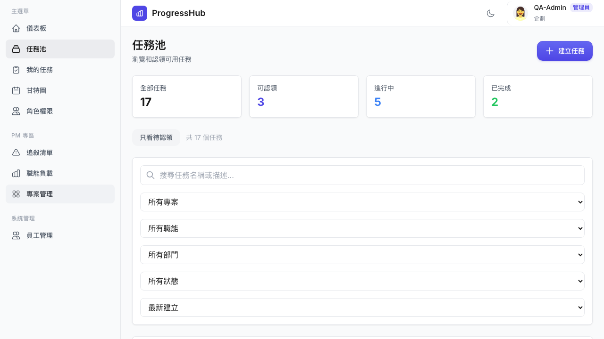

2. 選擇「指派任務」類型，填入標題，選擇專案「UI 改版計畫」，選擇部門「企劃部」
   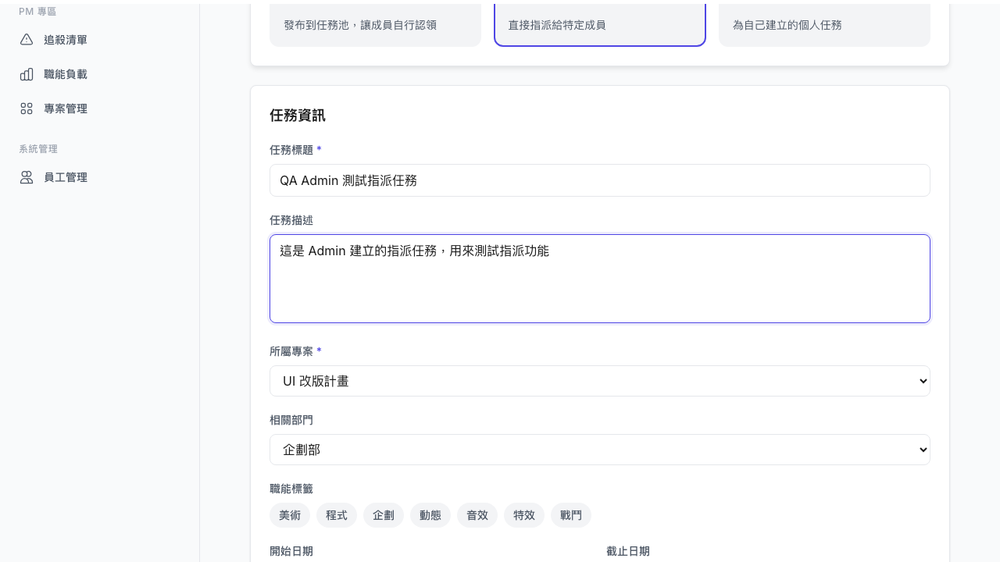

3. 點擊「指派給」欄位下拉搜尋
   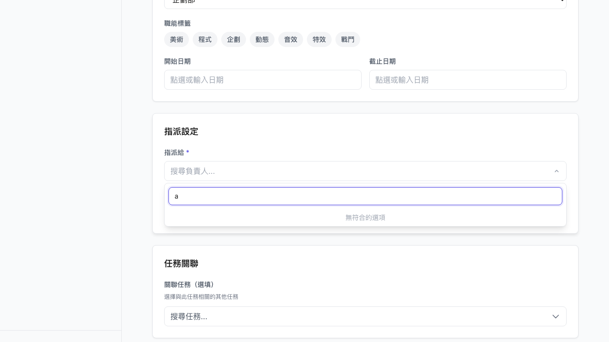

4. **Observe:** 下拉顯示「無符合的選項」，輸入任何關鍵字也無結果，無法選擇負責人

---

### ISSUE-002: Dashboard 統計數值對 ADMIN 全為 0

| Field | Value |
|-------|-------|
| **Severity** | high |
| **Category** | functional |
| **URL** | https://progresshub-cb.zeabur.app/dashboard |
| **Repro Video** | N/A |

**Description**

以 ADMIN 角色登入後，儀表板的「總任務數」「已完成」「進行中」「待認領」四個統計數字全部顯示 0，且「我的進行中任務」也顯示空白。但實際上系統中有多個專案和任務（可從追殺清單看到 8 個逾期任務）。Dashboard 應顯示 ADMIN 可見的全域統計，或至少顯示個人任務統計。

**Repro Steps**

1. 以 ADMIN 角色登入（姓名 QA-Admin，角色選「管理者」）
   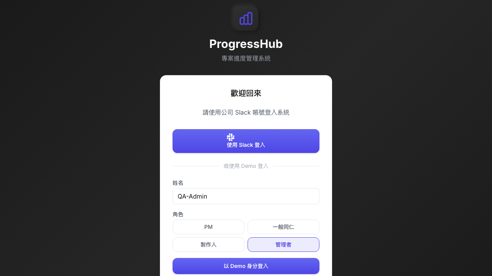

2. 登入後自動進入儀表板
   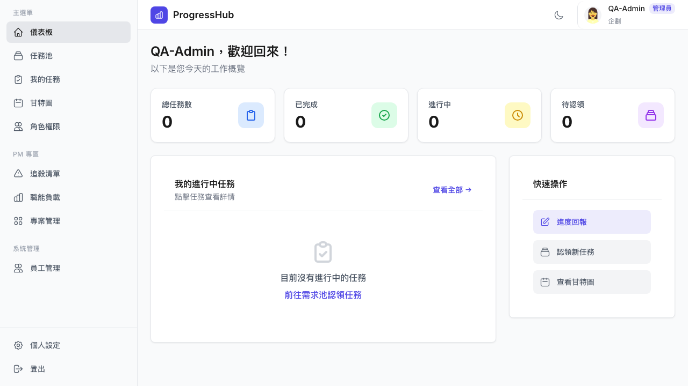

3. **Observe:** 所有統計指標均為 0，「目前沒有進行中的任務」
   

---

### ISSUE-003: 專案管理沒有刪除功能

| Field | Value |
|-------|-------|
| **Severity** | high |
| **Category** | functional |
| **URL** | https://progresshub-cb.zeabur.app/projects |
| **Repro Video** | N/A |

**Description**

在專案管理頁面，點擊任意專案卡片會打開編輯 Modal，但 Modal 內只有「儲存變更」和「取消」按鈕，沒有任何刪除專案的入口。對 ADMIN 來說，應能刪除測試或廢棄的專案。

**Repro Steps**

1. 前往「專案管理」頁面
   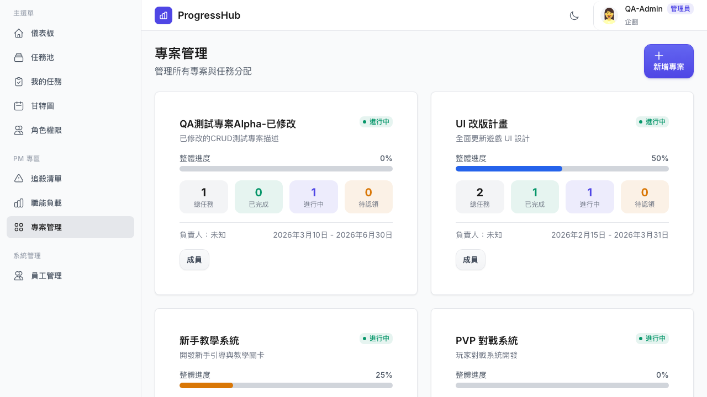

2. 點擊任意專案卡片，打開編輯 Modal
   

3. **Observe:** Modal 只顯示編輯表單和「儲存變更」/「取消」按鈕，沒有刪除按鈕
   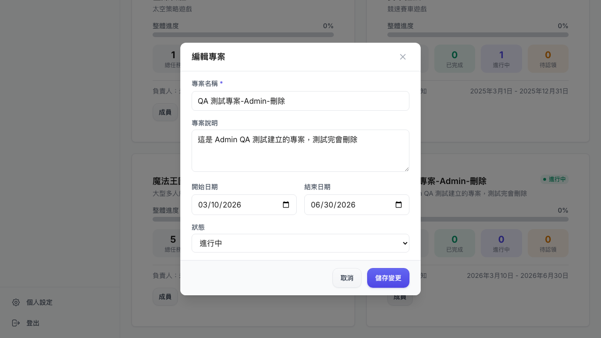

---

### ISSUE-004: 所有專案顯示「負責人：未知」

| Field | Value |
|-------|-------|
| **Severity** | medium |
| **Category** | content |
| **URL** | https://progresshub-cb.zeabur.app/projects |
| **Repro Video** | N/A |

**Description**

專案管理頁面的所有專案卡片均顯示「負責人：未知」，即使這些專案應該有 PM 負責人。這可能是 API 回傳資料中 projectManager 欄位為 null 或後端未正確關聯。

**Repro Steps**

1. 前往「專案管理」頁面
   

2. **Observe:** 所有 8 個專案卡片都顯示「負責人：未知」

---

### ISSUE-005: 職能負載頁面所有職能顯示「目前無該職能成員」

| Field | Value |
|-------|-------|
| **Severity** | medium |
| **Category** | content |
| **URL** | https://progresshub-cb.zeabur.app/pm/workload |
| **Repro Video** | N/A |

**Description**

職能負載分析頁面的每個職能卡片都顯示「目前無該職能成員」，但員工管理中可以看到有超過 20 名員工，且各員工都有職能設定。例如美術有 3 人 6 任務，卻顯示無成員，這個提示語應只在該職能真的沒有人員時顯示。

**Repro Steps**

1. 點選左側選單「職能負載」
   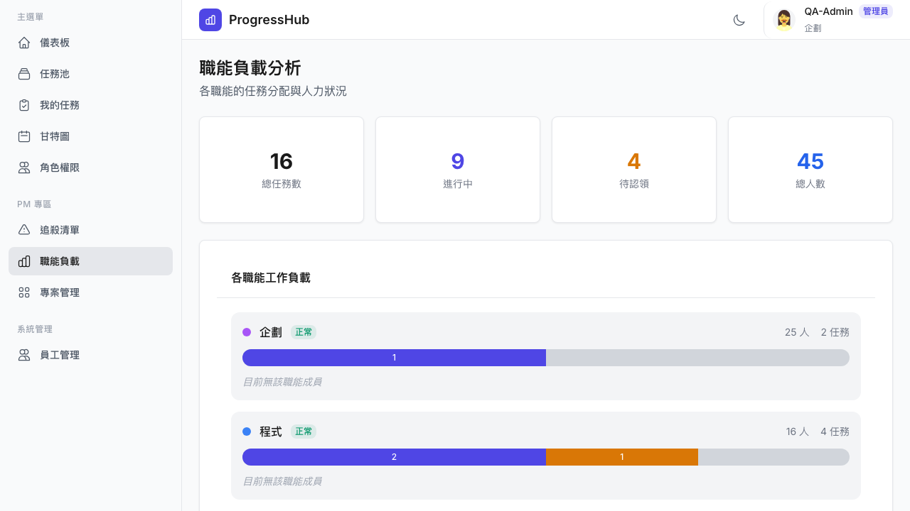

2. **Observe:** 所有職能（企劃、程式、美術等）都顯示「目前無該職能成員」訊息

---

### ISSUE-006: 點擊專案卡片直接開啟編輯 Modal 而非詳情頁

| Field | Value |
|-------|-------|
| **Severity** | medium |
| **Category** | ux |
| **URL** | https://progresshub-cb.zeabur.app/projects |
| **Repro Video** | N/A |

**Description**

在專案管理頁面，點擊專案卡片會直接彈出編輯表單 Modal，而不是顯示專案詳細資訊。對大多數情況下，使用者點擊卡片是想「查看」，而非立即「編輯」。這種行為容易造成誤操作（不小心修改資料）。建議改為：點擊卡片進詳情，詳情頁內提供編輯按鈕。

**Repro Steps**

1. 前往「專案管理」
   

2. 點擊任意專案卡片
   

3. **Observe:** 直接開啟編輯 Modal，沒有只讀詳情頁

---

### ISSUE-007: 員工編輯 Modal 沒有成功/失敗回饋（需確認）

| Field | Value |
|-------|-------|
| **Severity** | low |
| **Category** | ux |
| **URL** | https://progresshub-cb.zeabur.app/admin/users |
| **Repro Video** | N/A |

**Description**

編輯員工資料並點擊「儲存變更」後，Modal 直接關閉，沒有觀察到明顯的 Toast 通知或任何成功提示。無法確認操作是否成功，需要再次打開 Modal 核對資料才能確認。（注意：個人設定的儲存有正常出現 Toast，但員工管理的儲存需要進一步確認是否有 Toast）

**Repro Steps**

1. 前往「員工管理」，點擊第一個員工的「編輯」按鈕
   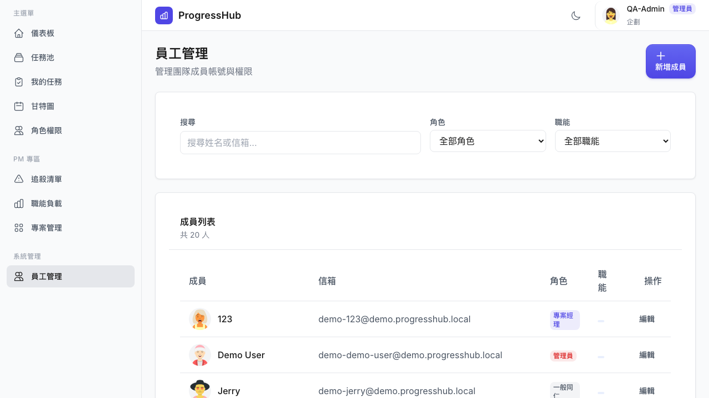

2. 更改角色為「部門主管」，點擊「儲存變更」
   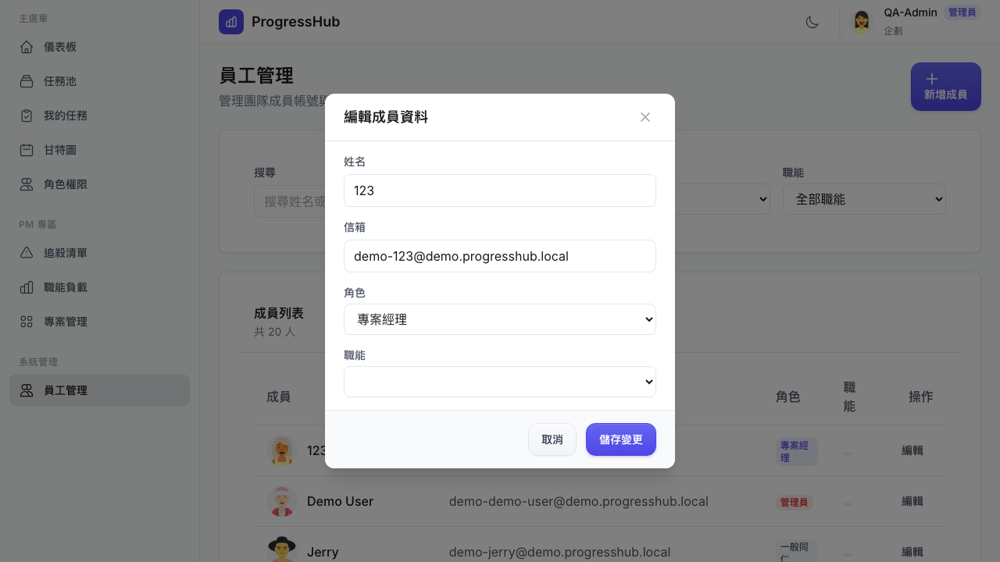

3. **Observe:** Modal 關閉，沒有觀察到明顯的成功提示（可能在短暫 Toast 後截圖才到）
   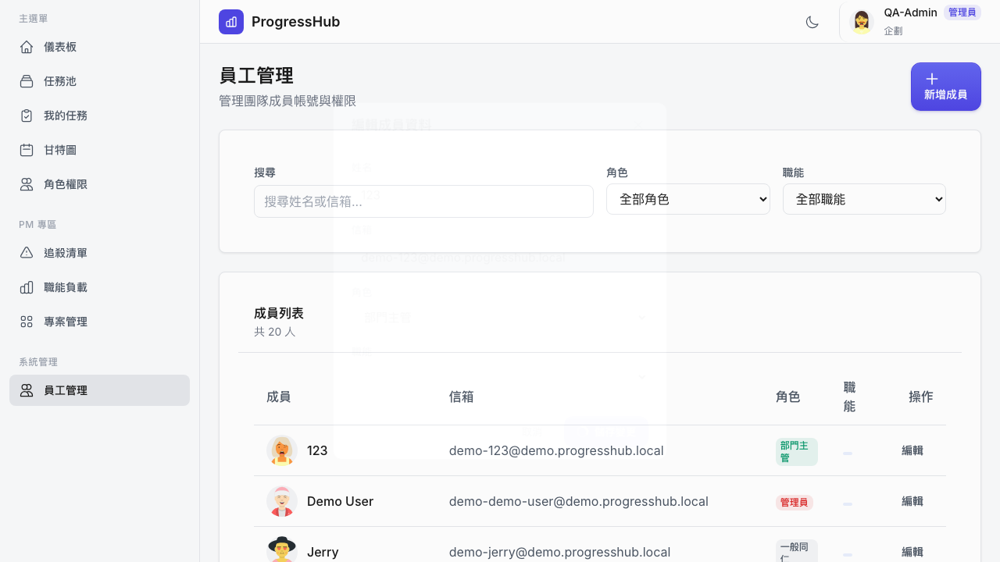

---

### ISSUE-008: 頭像外部服務 (avataaars) 載入失敗

| Field | Value |
|-------|-------|
| **Severity** | low |
| **Category** | visual |
| **URL** | https://progresshub-cb.zeabur.app（全站） |
| **Repro Video** | N/A |

**Description**

Performance API 顯示多個 avataaars.io 頭像請求的 responseStatus 為 0（失敗），包括 QA-Admin、Demo User、Jerry 等多個使用者的頭像。這可能導致部分介面顯示空白頭像或預設圖示。外部服務不可用時，應有優雅的 fallback（如顯示姓名首字母）。

**Repro Steps**

1. 以任何角色登入
2. 在包含使用者頭像的頁面（員工管理、追殺清單）
3. **Observe:** avataaars.io 服務請求失敗（status=0），頭像可能顯示為預設圖示

---

## What Worked Well

- 登入流程（Demo 登入）流暢，角色選擇後正確隱藏不相關的 UI 元素（ADMIN 選擇後隱藏專案選擇）
- 員工管理：員工列表顯示正常，新增/編輯成員功能均可使用
- 專案管理：新增專案功能正常，表單驗證完整
- 任務池：任務池任務建立成功，立即反映在列表中
- 個人設定：修改姓名後有正確的 Toast 成功提示
- 追殺清單：ADMIN 可正確看到全域逾期任務（8 個）
- 甘特圖：可正常載入，所有專案任務可見，篩選功能完整
- 職能負載：統計數字顯示正確（16 任務、45 人）
- 角色權限說明頁：內容完整清楚
- 整合設定：Slack / GitLab 連結入口存在且可見
- 深色模式切換按鈕存在且可點擊

## Test Environment Notes

- 測試時間：2026-03-10
- ADMIN 角色 Demo 帳號（姓名：QA-Admin）
- Google Fonts 和 avataaars 外部資源因網路環境可能無法載入（非 app 本身問題）
- 測試期間建立了：1 個測試專案「QA 測試專案-Admin-刪除」、1 個任務池任務「QA Admin 測試任務池任務」、1 個員工「QA Test New Member」
