# Dogfood Report: ProgressHub

| Field | Value |
|-------|-------|
| **Date** | 2026-03-10 |
| **App URL** | https://progresshub-cb.zeabur.app |
| **Session** | progresshub-employee |
| **Scope** | EMPLOYEE 角色 — 登入、儀表板、我的任務、任務池、甘特圖、回報頁面 |

## Summary

| Severity | Count |
|----------|-------|
| Critical | 0 |
| High | 2 |
| Medium | 5 |
| Low | 1 |
| **Total** | **8** |

## Issues

### ISSUE-001: EMPLOYEE 角色登入頁顯示不必要的專案選擇框

| Field | Value |
|-------|-------|
| **Severity** | medium |
| **Category** | ux |
| **URL** | https://progresshub-cb.zeabur.app/ |
| **Repro Video** | N/A |

**Description**

在 Demo 登入頁面，選擇「一般同仁」（EMPLOYEE）角色後，頁面仍顯示一大串專案選擇 checkbox（PVP 對戰系統、QA測試專案Alpha、UI 改版計畫等共 7 個）。EMPLOYEE 是一般員工，不需要手動選擇有權限的專案範圍，這個介面元素對 EMPLOYEE 角色沒有意義，且可能造成使用者困惑。根據代碼註解，專案選擇應只對 ADMIN 角色有意義（讓管理員限縮可見專案範圍），EMPLOYEE 應跳過此步驟。

**Repro Steps**

1. 開啟 https://progresshub-cb.zeabur.app/，等待載入
   

2. 在姓名欄填入「QA-Employee」，點選「一般同仁」角色按鈕
   **Observe:** 頁面仍顯示 7 個專案 checkbox，對 EMPLOYEE 角色而言這些選項無意義
   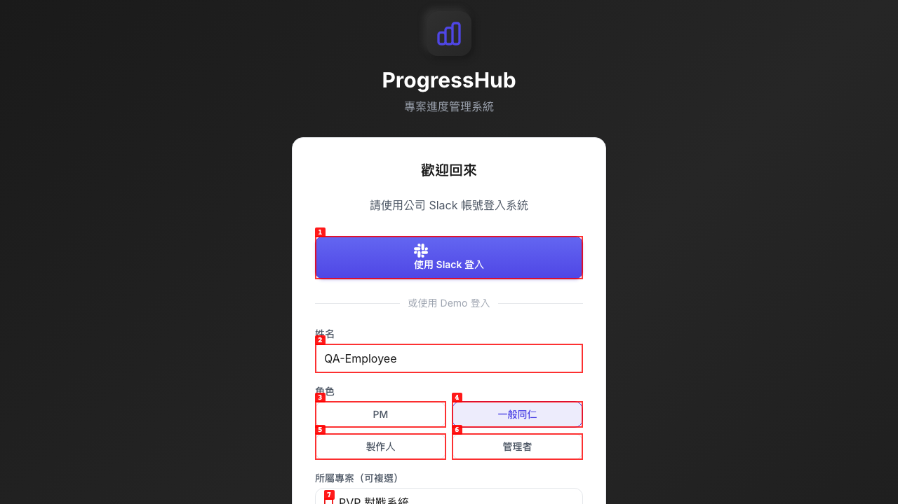

---

### ISSUE-002: 認領任務成功後無任何視覺回饋

| Field | Value |
|-------|-------|
| **Severity** | high |
| **Category** | ux |
| **URL** | https://progresshub-cb.zeabur.app/task-pool |
| **Repro Video** | videos/issue-002-claim-silent-fail.webm |

**Description**

點擊「認領任務」按鈕後，系統後端實際上成功完成了認領操作（重新載入頁面後任務狀態確實更新），但前端完全沒有提供任何視覺回饋：無 toast 通知、無成功訊息、無按鈕狀態變化（loading / 禁用）、任務卡片不立即更新。使用者在第一次操作後無從得知是否成功，極有可能重複點擊導致重複操作。

**Repro Steps**

1. 開啟任務池頁面 https://progresshub-cb.zeabur.app/task-pool，確認「可認領：2」
   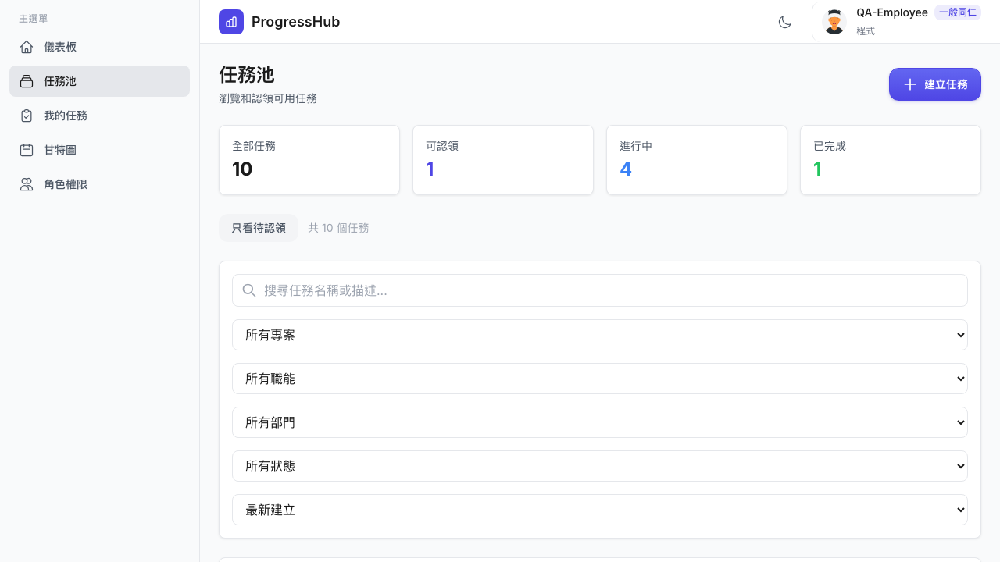

2. 點擊「UI 介面設計」任務的「認領任務」按鈕
   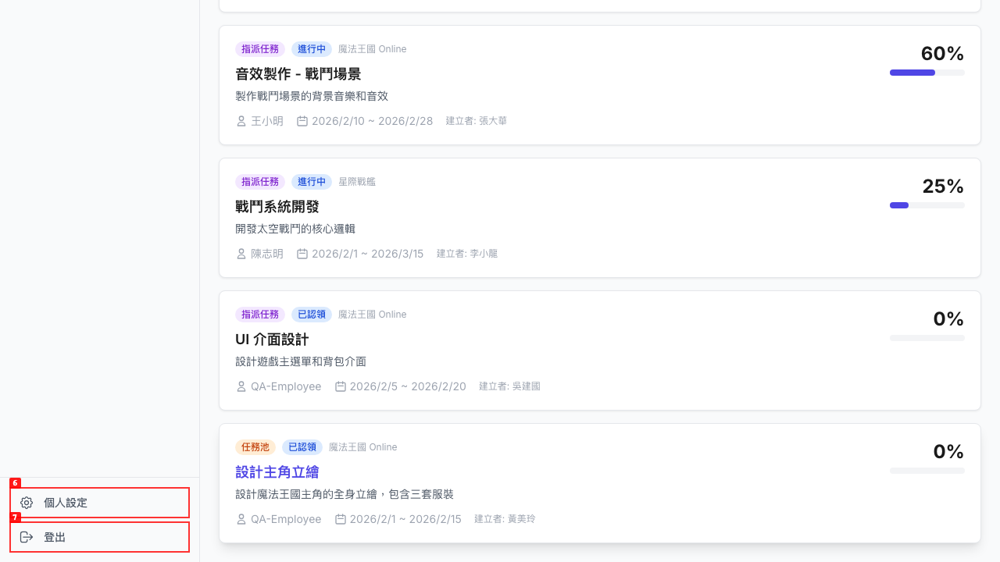

3. **Observe:** 按鈕點擊後無任何反應，沒有 loading 指示、沒有成功/失敗的 toast 訊息，任務卡片狀態不立即變更
   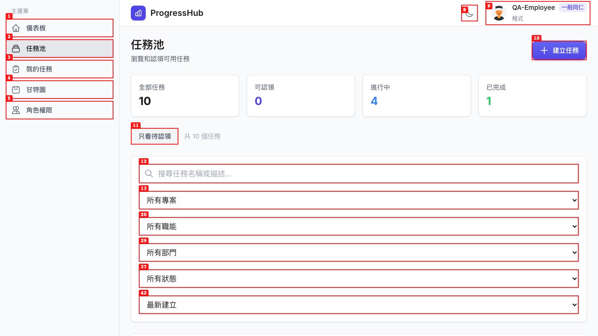

4. 重新整理頁面後，才能看到任務已被認領（可認領數變為 0，任務負責人顯示 QA-Employee）
   

---

### ISSUE-003: 認領後「設計主角立繪」任務缺少狀態標籤

| Field | Value |
|-------|-------|
| **Severity** | medium |
| **Category** | visual |
| **URL** | https://progresshub-cb.zeabur.app/task-pool |
| **Repro Video** | N/A |

**Description**

認領「設計主角立繪」任務後，頁面重新整理，該任務卡片缺少應有的「任務池 已認領」等狀態標籤文字。相比之下，「UI 介面設計」任務正確顯示「指派任務 已認領 魔法王國 Online」。兩個同樣經過認領的任務，資料顯示不一致，顯示任務卡片的狀態標籤渲染有問題。

**Repro Steps**

1. 認領「設計主角立繪」任務，重新整理任務池頁面
   **Observe:** 「設計主角立繪」任務卡片末尾缺少狀態/來源類型標籤，而「UI 介面設計」任務正確顯示「指派任務 已認領 魔法王國 Online」
   

---

### ISSUE-004: 甘特圖多個任務顯示「未知」負責人

| Field | Value |
|-------|-------|
| **Severity** | medium |
| **Category** | content |
| **URL** | https://progresshub-cb.zeabur.app/gantt |
| **Repro Video** | N/A |

**Description**

甘特圖中，多個有負責人的任務顯示「未知」而非實際姓名。確認受影響的任務包括：「賽車模型建模」（負責人: 林小美）、「實作新手教學流程邏輯」（負責人: 王小明）、「新手教學 UI 設計」（負責人: 李美玲）、「音效製作 - 戰鬥場景」（負責人: 王小明）、「API 串接 - 用戶系統」（負責人: 王小明）。這些任務在任務池頁面正確顯示負責人，但甘特圖的渲染邏輯無法正確取得負責人名稱。

**Repro Steps**

1. 登入後前往甘特圖頁面
2. 開啟「按專案分組」，或點擊「逾期任務」篩選
   **Observe:** 多個任務顯示「逾期 未知」，任務在任務池頁面有正確的負責人但甘特圖無法顯示
   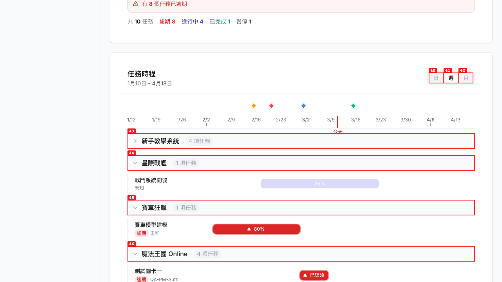

---

### ISSUE-005: 我的任務頁面「進行中」計數與任務狀態標籤不一致

| Field | Value |
|-------|-------|
| **Severity** | medium |
| **Category** | functional |
| **URL** | https://progresshub-cb.zeabur.app/my-tasks |
| **Repro Video** | N/A |

**Description**

我的任務頁面頂部顯示「2 個進行中」，但任務卡片上的狀態標籤顯示「已認領」而非「進行中」。計數器和實際狀態標籤使用了不同的邏輯計算，導致顯示矛盾。此外，我的任務頁面的操作按鈕與回報頁面不一致：回報頁面有「繼續、更新進度、暫停、卡關、完成」五個按鈕，我的任務頁面只有「繼續、更新、卡關、完成」（少了「暫停」）。

**Repro Steps**

1. 認領任務池任務後，前往「我的任務」頁面
   **Observe:** 頂部顯示「2 個進行中」，但任務卡片狀態標籤顯示「已認領」；且操作按鈕數量（4個）少於回報頁面（5個）
   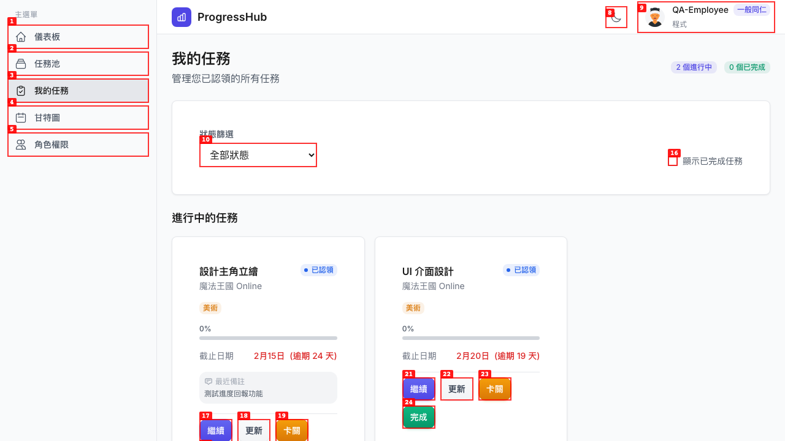

---

### ISSUE-006: 建立任務/回報成功後無任何 toast 通知

| Field | Value |
|-------|-------|
| **Severity** | medium |
| **Category** | ux |
| **URL** | https://progresshub-cb.zeabur.app/task-pool/create |
| **Repro Video** | N/A |

**Description**

建立任務成功後，系統悄悄清空表單並停留在建立頁面，沒有顯示任何成功 toast 通知，也沒有自動導向至任務池或我的任務頁面。使用者無法得知操作是否成功，必須手動前往任務池確認。同樣的問題也出現在「繼續」、「更新進度」等回報操作，以及「完成」、「卡關」等狀態變更動作上——所有寫入操作均缺乏即時操作結果回饋。

**Repro Steps**

1. 前往任務池，點擊「建立任務」連結
2. 選擇任意任務類型，填寫必填資訊，點擊「建立任務」
   **Observe:** 表單被清空，停留在同一頁面，無 toast 通知、無成功訊息、無自動跳轉
   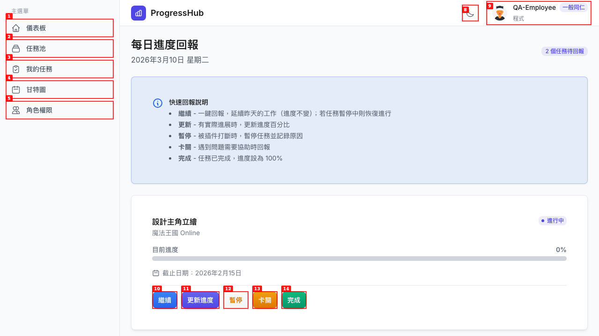

---

### ISSUE-007: 儀表板任務標題無法點擊但提示文字說「點擊查看詳情」

| Field | Value |
|-------|-------|
| **Severity** | medium |
| **Category** | functional |
| **URL** | https://progresshub-cb.zeabur.app/dashboard |
| **Repro Video** | videos/issue-007-task-click.webm |

**Description**

儀表板「我的進行中任務」區塊有提示文字「點擊任務查看詳情」，但任務標題（「設計主角立繪」、「UI 介面設計」等）是靜態的 `<h4>` 標題，無法點擊，也沒有連結導向任務詳情。整個任務卡片都無法點擊進入詳情頁。相同問題也出現在「我的任務」和「任務池」頁面 — 任務標題均為非可點擊元素，系統沒有任務詳情頁面。

**Repro Steps**

1. 認領任務後，前往儀表板，看到「我的進行中任務」區塊中有任務卡片，提示「點擊任務查看詳情」
   

2. 點擊任務標題「設計主角立繪」
   **Observe:** 毫無反應，頁面無任何變化，沒有任務詳情彈跳視窗或詳情頁面
   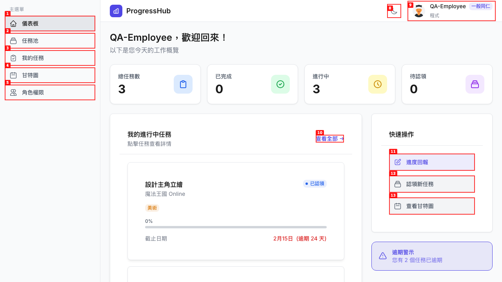

---

### ISSUE-008: EMPLOYEE 角色可成功建立「指派任務」（前後端均未攔截）

| Field | Value |
|-------|-------|
| **Severity** | high |
| **Category** | functional |
| **URL** | https://progresshub-cb.zeabur.app/task-pool/create |
| **Repro Video** | videos/issue-006-employee-assign.webm |

**Description**

根據角色權限頁面明確說明，「一般同仁」（EMPLOYEE）不具備「指派任務」權限，只能認領任務、回報進度、建立自建任務。然而在建立任務頁面，EMPLOYEE 可以選擇「指派任務」類型，填寫表單並成功提交，任務確實被建立（任務池任務總數由 10 增加至 11）。這是一個授權繞過問題，前端未對 EMPLOYEE 隱藏「指派任務」選項，後端也未拒絕此請求。

**Repro Steps**

1. 以 EMPLOYEE 角色登入，進入任務池頁面
   

2. 點擊「建立任務」，在類型選擇頁面選擇「指派任務 - 直接指派給特定成員」
   **Observe:** 系統允許 EMPLOYEE 選擇「指派任務」類型，表單展開並顯示「指派給」欄位
   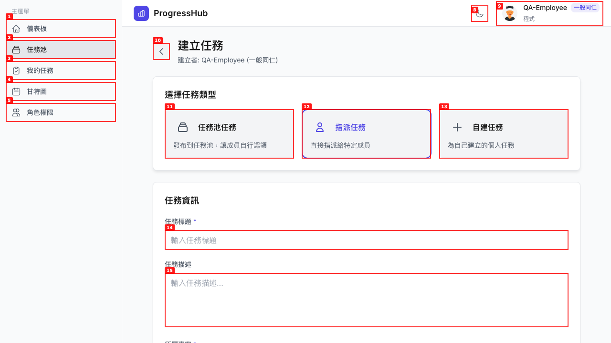

3. 填寫任務標題「測試 EMPLOYEE 指派任務」、選擇專案「魔法王國 Online」、指派給「Demo User」，點擊「建立任務」
   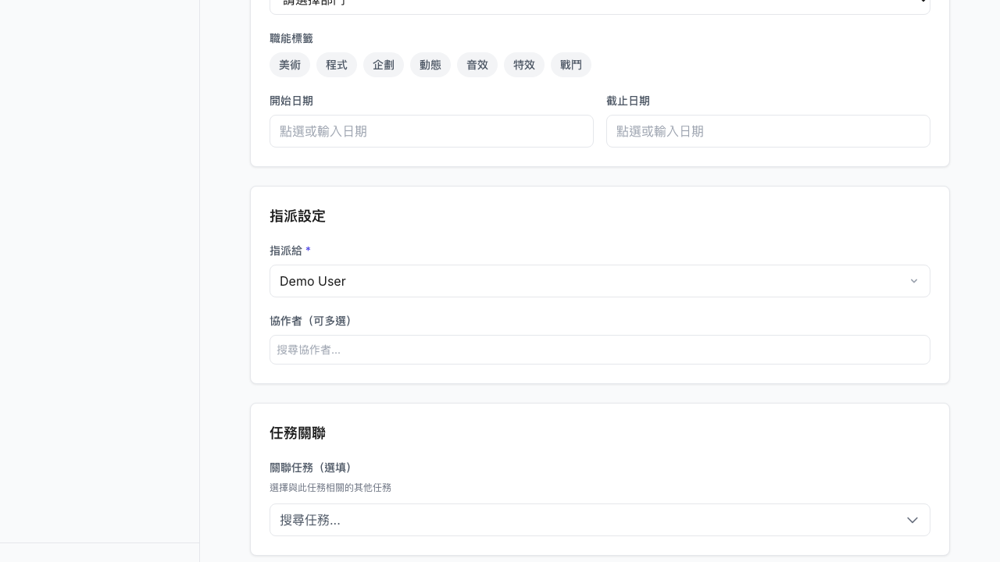

4. **Observe:** 任務成功建立，表單清空，任務池任務數從 10 增加至 11，沒有任何「權限不足」的錯誤訊息
   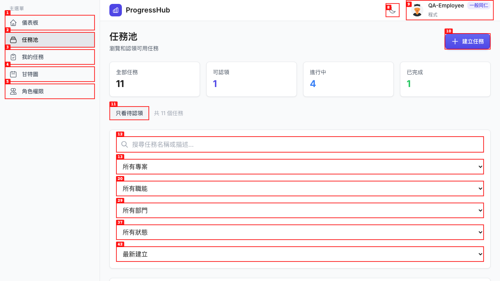

---

