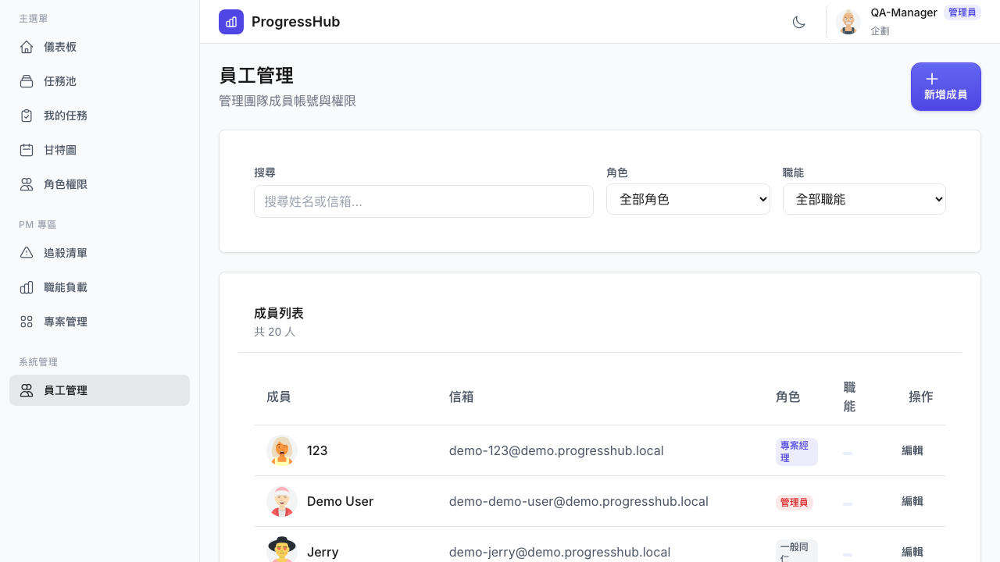
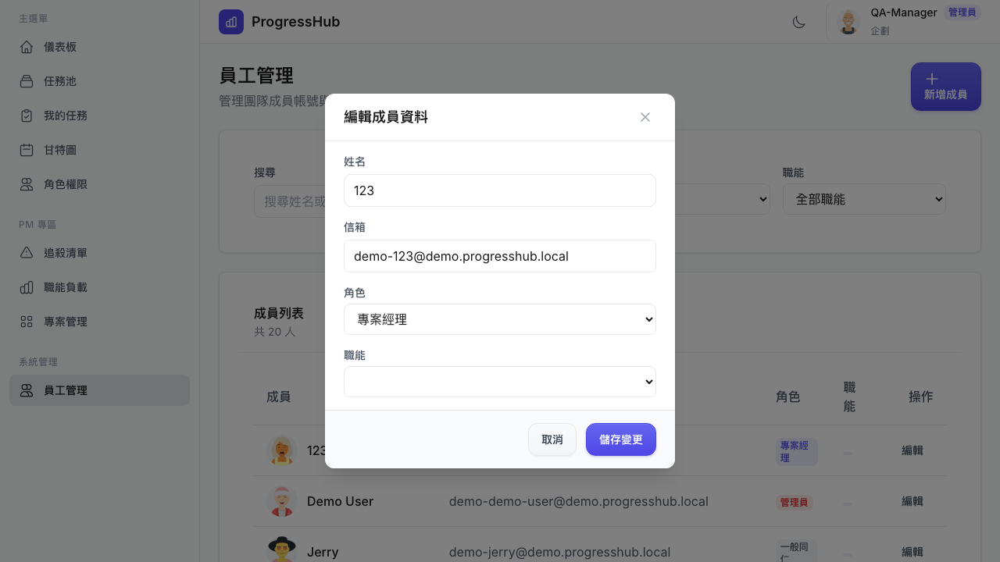
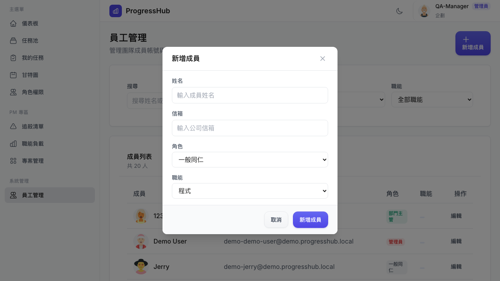
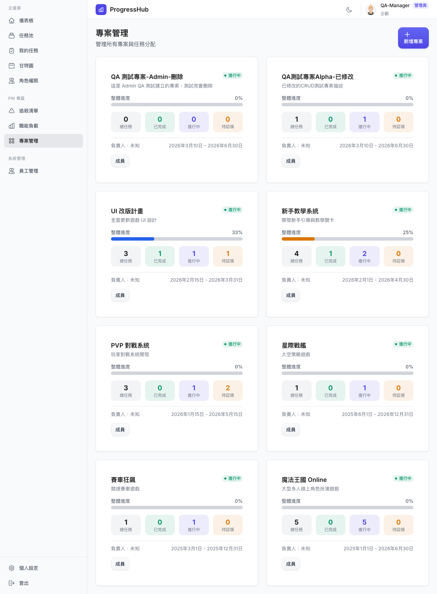
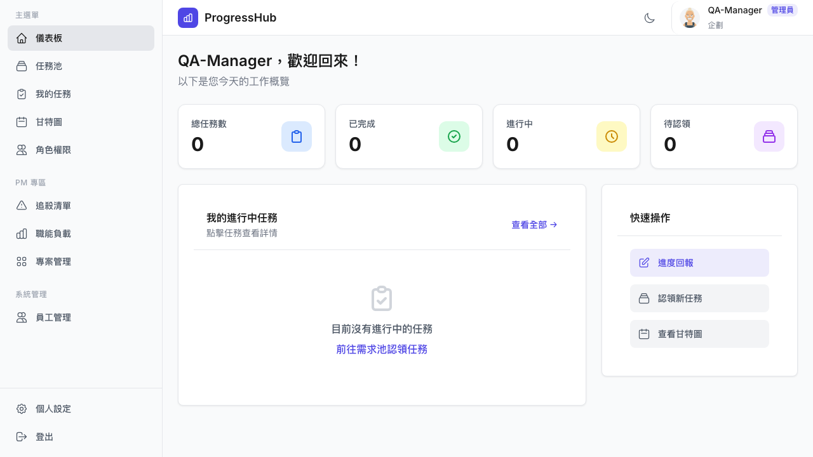
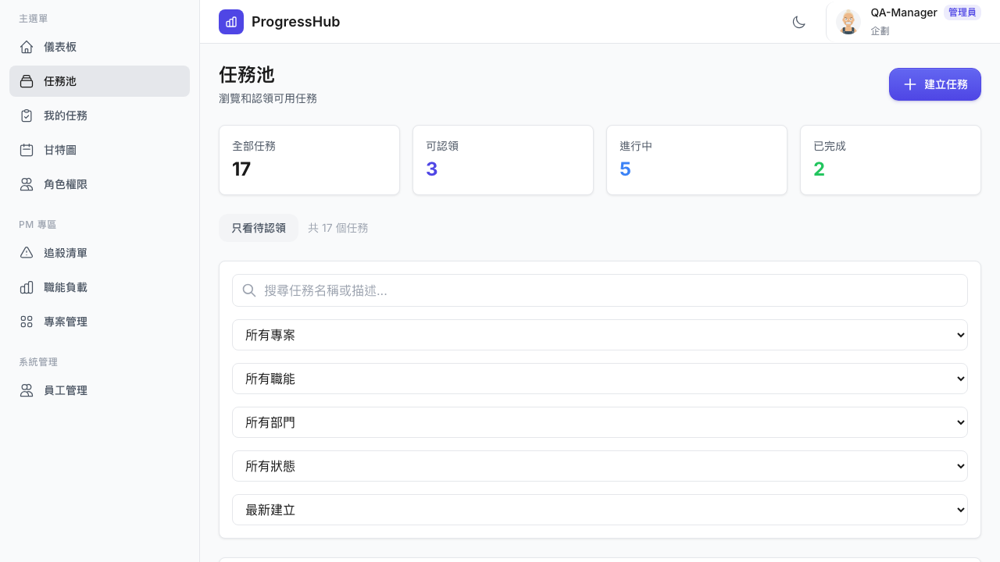
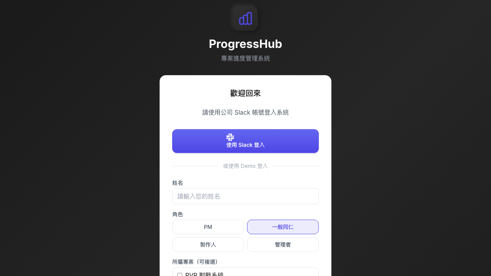
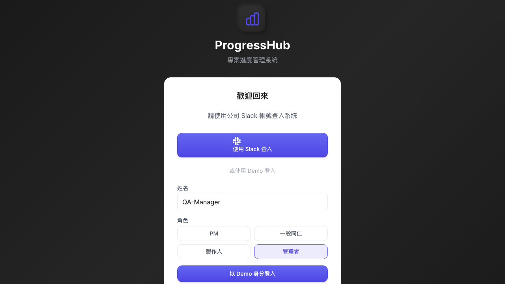

# Dogfood Report: ProgressHub — MANAGER Role

| Field | Value |
|-------|-------|
| **Date** | 2026-03-10 |
| **App URL** | https://progresshub-cb.zeabur.app |
| **Session** | progresshub-manager |
| **Scope** | MANAGER (管理者) role — all accessible pages |

## Summary

| Severity | Count |
|----------|-------|
| Critical | 0 |
| High | 2 |
| Medium | 2 |
| Low | 2 |
| **Total** | **6** |

## Pages Tested

| Page | URL | Accessible | Status |
|------|-----|-----------|--------|
| 登入頁 | / | 是 | 正常 |
| 儀表板 | /dashboard | 是 | 正常 |
| 我的任務 | /my-tasks | 是 | 正常 |
| 任務池 | /task-pool | 是 | 正常 |
| 甘特圖 | /gantt | 是 | 正常 |
| 每日進度回報 | /report | 是 | 正常 |
| 員工管理 | /admin/users | 是 | 有問題 (ISSUE-001, 002) |
| 專案管理 | /projects | 是 | 有問題 (ISSUE-003) |
| 追殺清單 | /pm/chase | 是 | 正常 |
| 職能負載 | /pm/workload | 是 | 正常 |
| 角色權限 | /roles | 是 | 正常 |
| 個人設定 | /settings | 是 | 正常 |

---

## Issues

### ISSUE-001: MANAGER 可將任何用戶提升為管理員（含自身角色以上）

| Field | Value |
|-------|-------|
| **Severity** | high |
| **Category** | functional / security |
| **URL** | https://progresshub-cb.zeabur.app/admin/users |
| **Repro Video** | N/A |

**Description**

MANAGER（部門主管）角色在員工管理頁面可以編輯所有用戶，並在角色下拉選單中選擇包含「管理員」在內的所有角色（一般同仁、專案經理、製作人、部門主管、管理員）。這意味著 MANAGER 可以將任何用戶（包含自己）提升為與自己同級或更高等級的管理員，形成權限升級漏洞。

預期行為：MANAGER 只應能編輯低於自己角色的用戶（如一般同仁），且只能將用戶指定為低於自身角色的職位。

**Repro Steps**

1. 以 MANAGER 身分登入，前往員工管理
   

2. 點擊任意用戶的「編輯」按鈕
   

3. **觀察：** 角色下拉選單顯示所有角色包括「管理員」，MANAGER 可選擇並儲存

---

### ISSUE-002: MANAGER 可新增任意角色的成員（包含管理員）

| Field | Value |
|-------|-------|
| **Severity** | high |
| **Category** | functional / security |
| **URL** | https://progresshub-cb.zeabur.app/admin/users |
| **Repro Video** | N/A |

**Description**

在員工管理頁面，MANAGER 可點擊「新增成員」並在角色欄位選擇任意角色（包含「管理員」）建立新帳號。這與 ISSUE-001 形成雙重路徑，讓 MANAGER 可繞過自身權限限制。

預期行為：新增成員時，角色選項應限制在低於 MANAGER 的角色範圍內。

**Repro Steps**

1. 以 MANAGER 身分登入，前往員工管理，點擊「新增成員」
   

2. **觀察：** 角色選單包含所有角色選項（一般同仁至管理員），MANAGER 可建立任意角色的帳號

---

### ISSUE-003: 專案管理頁「負責人」全部顯示「未知」

| Field | Value |
|-------|-------|
| **Severity** | medium |
| **Category** | functional / content |
| **URL** | https://progresshub-cb.zeabur.app/projects |
| **Repro Video** | N/A |

**Description**

在專案管理頁面，每個專案卡片的「負責人」欄位均顯示為「未知」，即使後端有 `createdById` 欄位記錄建立者。

根因分析：後端 `/api/projects` 回應只回傳 `{ id, name, description, status, startDate, endDate, createdAt, updatedAt, createdById }`，缺少已解析的 PM/負責人名稱物件。前端嘗試顯示 PM 名稱時因欄位不存在而回退為「未知」。

預期行為：每個專案應顯示負責 PM 的姓名。

**Repro Steps**

1. 以 MANAGER 身分登入，前往專案管理 `/projects`
   

2. **觀察：** 所有 8 個專案的「負責人」均顯示「未知」

---

### ISSUE-004: 儀表板初次載入任務統計全為 0（新帳號無任務時）

| Field | Value |
|-------|-------|
| **Severity** | low |
| **Category** | ux / content |
| **URL** | https://progresshub-cb.zeabur.app/dashboard |
| **Repro Video** | N/A |

**Description**

新建的 MANAGER Demo 帳號（QA-Manager）初次登入時，儀表板顯示「總任務數 0 / 已完成 0 / 進行中 0 / 待認領 0」，沒有任何引導說明。「待認領」統計顯示 0，但實際任務池中有 3 個可認領任務。

儀表板的「待認領」數字似乎只統計分配給該用戶的待認領任務，而非系統中可供認領的任務數量，但欄位標籤未說明此差異，可能造成用戶困惑。

預期行為：應更清楚說明各統計數字的範圍（「我的任務」vs「系統任務」），或為新帳號提供引導。

**Repro Steps**

1. 以全新的 MANAGER 帳號登入（未認領任何任務前）
   

2. **觀察：** 所有統計數字為 0，但任務池實際有可認領任務

---

### ISSUE-005: 任務池顯示全系統所有任務（未做成員範圍限制）

| Field | Value |
|-------|-------|
| **Severity** | medium |
| **Category** | functional / security |
| **URL** | https://progresshub-cb.zeabur.app/task-pool |
| **Repro Video** | N/A |

**Description**

MANAGER 在任務池可看到全系統 17 個任務，橫跨所有 7 個專案。根據 MEMORY.md 中的已知問題記錄（`getPoolTasks() 返回 500 任務無角色或專案成員過濾`），這是一個已知的授權問題，任何已驗證的用戶都能看到所有任務。MANAGER 應只看到其管轄範圍內的任務（按部門或指派的專案）。

注意：本次 QA 未能確認後端是否已對 MANAGER 做任何範圍限制，因此以可觀察行為記錄。

**Repro Steps**

1. 以 MANAGER 身分登入，前往任務池
   

2. **觀察：** 頁面頂部顯示「全部任務 17」，且專案篩選選項包含所有 7 個無關聯的專案

---

### ISSUE-006: 登入表單預選角色無明確視覺提示

| Field | Value |
|-------|-------|
| **Severity** | low |
| **Category** | ux / accessibility |
| **URL** | https://progresshub-cb.zeabur.app |
| **Repro Video** | N/A |

**Description**

登入頁面的 Demo 角色選擇區塊，點擊「管理者」後，「管理者」按鈕顯示選中樣式，但沒有 ARIA `aria-pressed` 或 `aria-selected` 屬性標記當前選中狀態，僅依賴視覺樣式，對輔助技術（螢幕閱讀器）不友善。另外，MANAGER 角色選中後專案清單正確消失（因為管理者有全域權限），但頁面沒有任何說明文字告知使用者為何專案選項消失。

**Repro Steps**

1. 前往登入頁
   

2. 點擊「管理者」角色按鈕
   

3. **觀察：** 專案核取方塊消失，無說明文字；按鈕選中狀態僅靠視覺區分

---

## Overall Assessment

MANAGER 角色大部分功能運作正常，可成功：
- 登入並進入所有應有權限的頁面
- 認領任務、更新進度、提交每日回報
- 查看追殺清單、職能負載等 PM 專區功能
- 管理員工（員工管理頁面完整可用）

主要問題集中在**權限邊界**：
- 員工管理中缺乏角色上限限制（ISSUE-001, 002），屬於安全性問題
- 資料顯示問題（ISSUE-003）影響使用體驗，後端需補充 PM 欄位

建議優先修復 ISSUE-001 和 ISSUE-002（安全性），其次修復 ISSUE-003（用戶體驗）。
