# Dogfood Report: ProgressHub Mobile QA

| Field | Value |
|-------|-------|
| **Date** | 2026-03-10 |
| **App URL** | https://progresshub-cb.zeabur.app |
| **Session** | progresshub-mobile |
| **Scope** | Mobile viewport (375x812) — iPhone SE/14 size, EMPLOYEE role (QA-Mobile) |

## Summary

| Severity | Count |
|----------|-------|
| Critical | 1 |
| High | 3 |
| Medium | 3 |
| Low | 2 |
| **Total** | **9** |

**Overall verdict:** The app has a solid mobile foundation — the sidebar hamburger menu works correctly, overlay closes on tap, stat cards stack properly, and no horizontal scroll overflow was detected on any page. However, several tap target size violations (below the 44pt iOS guideline) and one missing touch-usable progress slider make certain interactions frustrating or unusable on mobile.

---

## Issues

### ISSUE-001: Progress slider in 回報進度 modal has 16px track height — nearly impossible to drag on mobile

| Field | Value |
|-------|-------|
| **Severity** | critical |
| **Category** | ux / accessibility |
| **URL** | https://progresshub-cb.zeabur.app/task-pool/{task-id} |
| **Repro Video** | N/A |

**Description**

The progress percentage slider (`input[type=range]`) in the 回報進度 modal renders with a 16px tall track. On mobile, native range input handles are very small and difficult to drag accurately. There is no custom styled handle that expands the touch area. Expected: slider thumb at least 44px in width/height or a custom touch-friendly component.

**Repro Steps**

1. Navigate to Task Pool and click any task card.
   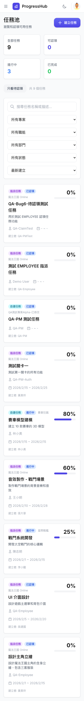

2. On task detail page, click "回報進度" button.
   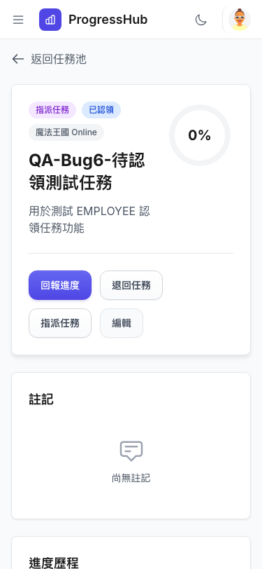

3. **Observe:** The progress slider appears but is 215×16px. Attempting to drag the thumb on a real device is very difficult.
   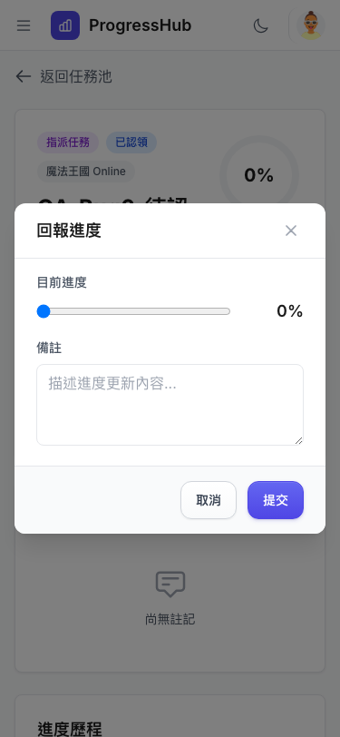

---

### ISSUE-002: "返回" back link/button only 24px tall — too small to tap on mobile

| Field | Value |
|-------|-------|
| **Severity** | high |
| **Category** | ux / accessibility |
| **URL** | https://progresshub-cb.zeabur.app/task-pool/{task-id} |
| **Repro Video** | N/A |

**Description**

The "返回任務池" back navigation link on the task detail page is only 24px tall (measured: `width: 108px, height: 24px`). The Apple HIG and Google Material both recommend minimum 44×44pt tap targets. This back button is the only navigation control to exit the detail view without using the hamburger sidebar.

**Repro Steps**

1. Navigate to Task Pool and click a task card to enter detail view.

2. **Observe:** "返回任務池" button at top of main content is 108×24px — below the 44pt minimum.
   

---

### ISSUE-003: Gantt chart time scale buttons (日/週/月) only 28px tall

| Field | Value |
|-------|-------|
| **Severity** | high |
| **Category** | ux / accessibility |
| **URL** | https://progresshub-cb.zeabur.app/gantt |
| **Repro Video** | N/A |

**Description**

The 日/週/月 time-scale toggle buttons in the Gantt chart timeline header measure 38×28px. Using `py-1` padding (`4px` top+bottom) makes them too short to tap reliably on a touchscreen. The "清除選取" (clear employee filter) icon button is even smaller at 20×20px.

**Affected buttons and sizes:**
- 日 / 週 / 月: 38×28px
- 清除選取 (icon): 20×20px
- 按專案分組: 96×34px
- 儲存目前條件: 123×34px

**Repro Steps**

1. Navigate to Gantt Chart.
   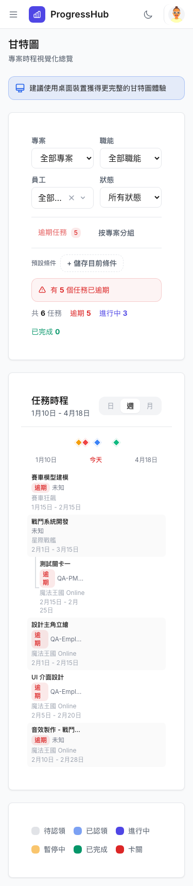

2. Scroll down to the "任務時程" section with the time-scale buttons.

3. **Observe:** 日/週/月 buttons are visually small and easy to miss-tap. The clear-employee icon is only 20×20px.
   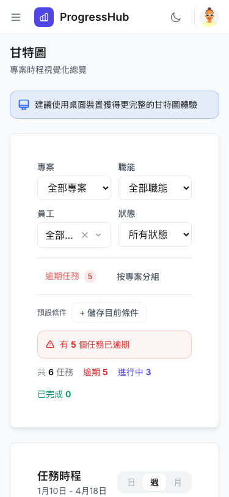

---

### ISSUE-004: "顯示已完成任務" checkbox tap area only 20px tall on My Tasks page

| Field | Value |
|-------|-------|
| **Severity** | high |
| **Category** | ux / accessibility |
| **URL** | https://progresshub-cb.zeabur.app/my-tasks |
| **Repro Video** | N/A |

**Description**

The "顯示已完成任務" checkbox toggle on My Tasks page has a 16×16px checkbox element and a 122×20px label wrapping it. The entire tap area is only 20px tall — well below the 44pt recommendation. Users will frequently miss this control on mobile.

**Repro Steps**

1. Navigate to My Tasks page.

2. **Observe:** "顯示已完成任務" checkbox/label appears in a small inline row, 20px tall total tap area.
   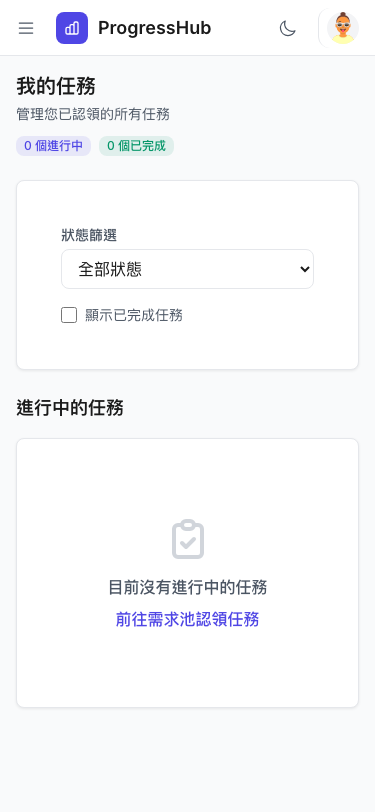

---

### ISSUE-005: Skill tag buttons on Create Task form only 32px tall

| Field | Value |
|-------|-------|
| **Severity** | medium |
| **Category** | ux |
| **URL** | https://progresshub-cb.zeabur.app/task-pool/create |
| **Repro Video** | N/A |

**Description**

The skill tag toggle buttons (美術, 程式, 企劃, 動態, 音效, 特效, 戰鬥) on the Create Task form are 52×32px. At 32px height they're below the comfortable 44pt minimum, making them error-prone to tap, especially for users creating tasks on mobile.

**Repro Steps**

1. Navigate to Create Task page (Task Pool → 建立任務).
   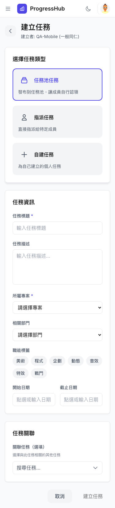

2. Scroll down to the "職能標籤" section.

3. **Observe:** Tag buttons are 52×32px — short enough to cause frequent mis-taps.

---

### ISSUE-006: Header icon buttons (hamburger, dark mode) are 36px — below 44pt guideline

| Field | Value |
|-------|-------|
| **Severity** | medium |
| **Category** | ux |
| **URL** | All pages |
| **Repro Video** | N/A |

**Description**

The hamburger menu button (開啟選單), dark mode toggle, and sidebar close button are all 36×36px. These are high-frequency controls on mobile and should meet the 44×44pt minimum. The user profile/avatar button is 49×40px which passes.

**Repro Steps**

1. Open any page (e.g., Dashboard).
   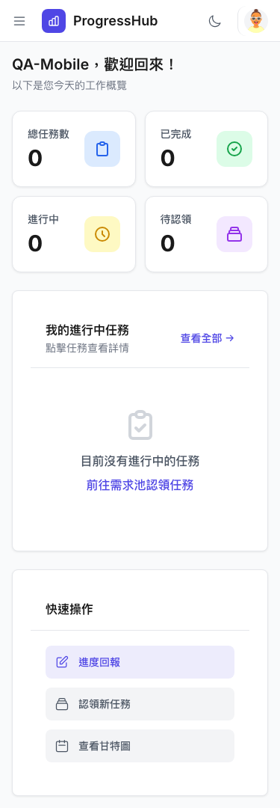

2. **Observe:** Header action buttons (hamburger ☰, dark mode toggle, sidebar ✕) measured at 36×36px.
   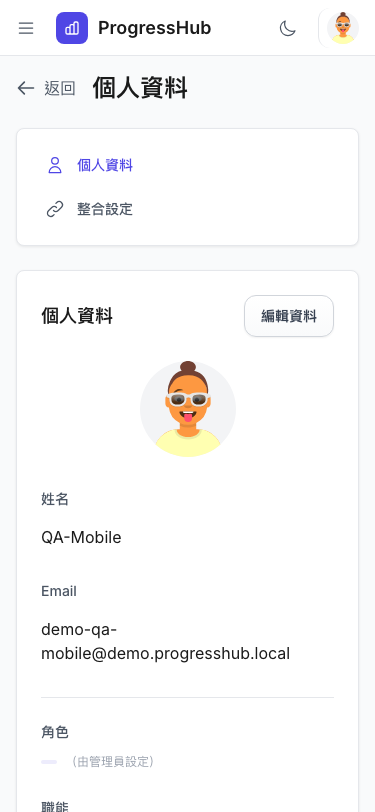

---

### ISSUE-007: No visible "desktop recommended" warning on Gantt chart mobile view

| Field | Value |
|-------|-------|
| **Severity** | medium |
| **Category** | ux / content |
| **URL** | https://progresshub-cb.zeabur.app/gantt |
| **Repro Video** | N/A |

**Description**

While the Gantt chart page correctly contains the text "建議使用桌面裝置獲得更完整的甘特圖體驗", this warning is embedded inline next to the project dropdown rather than displayed as a prominent banner at the top of the page. On mobile, users may not notice it and attempt to use the Gantt chart controls, which are cramped at 375px width. The Gantt timeline task bars are functional but the chart is not optimized for mobile workflows.

**Repro Steps**

1. Navigate to Gantt Chart on mobile.
   

2. **Observe:** The desktop recommendation text is barely visible inline. No prominent mobile banner exists.
   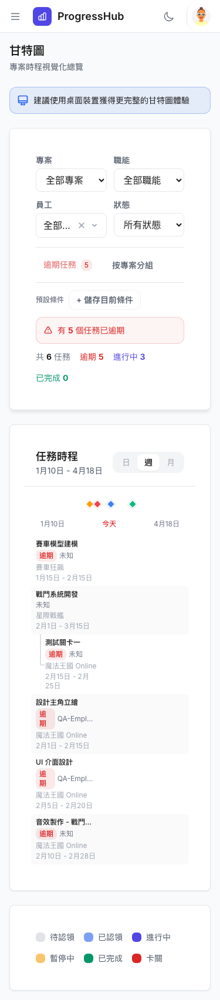

---

### ISSUE-008: Task Pool "只看待認領" toggle button is 36px tall (borderline)

| Field | Value |
|-------|-------|
| **Severity** | low |
| **Category** | ux |
| **URL** | https://progresshub-cb.zeabur.app/task-pool |
| **Repro Video** | N/A |

**Description**

The "只看待認領" filter toggle button measures 102×36px. While functional, it is 8px short of the 44pt guideline and sits adjacent to a 343px-wide search input, making it easy to miss-tap.

**Repro Steps**

1. Navigate to Task Pool.
   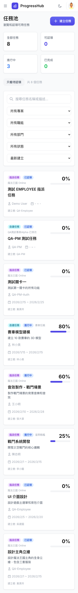

2. **Observe:** The toggle button is in the filter bar, 36px tall.

---

### ISSUE-009: User name and role text hidden on mobile header (role information not accessible)

| Field | Value |
|-------|-------|
| **Severity** | low |
| **Category** | ux / content |
| **URL** | All pages |
| **Repro Video** | N/A |

**Description**

On desktop, the header shows the user's name, role (一般同仁), and department. On mobile, these labels are hidden via `hidden sm:block` CSS. The mobile header shows only the user's avatar button with the full text collapsed. Users cannot see their role or department without tapping into the Profile/Settings page. This is acceptable UX but could be improved by showing at minimum the role label in a tooltip or accessible text.

**Repro Steps**

1. Open any page on mobile.
   

2. **Observe:** Header only shows small avatar (49×40px). Name, role, department are invisible.

---

## What Works Well on Mobile

- **Hamburger menu**: Opens/closes smoothly. Backdrop overlay closes sidebar on tap. Navigation buttons in sidebar are well-sized (231×40px).
- **Dashboard stat cards**: Stack into a 2-column grid correctly on 375px width.
- **Task Pool**: All 5 filter dropdowns stack vertically (each 309px wide). No horizontal overflow.
- **Task cards**: Full width (343px), text readable (minimum 14px). Task cards navigate to detail on tap.
- **Progress modal**: Modal fits within viewport (343×364px). 回報進度, 退回任務, 指派任務, 編輯 buttons are 42px tall.
- **No horizontal overflow**: Tested on Dashboard, My Tasks, Task Pool, Gantt, Settings — `scrollWidth === clientWidth` on all pages.
- **Dark mode**: Toggles correctly on mobile.
- **Create Task form**: Task type selector buttons are large (293×104px). Form inputs are properly sized.
- **No 12px text in content**: Minimum content text is 14px. The only 12px text is secondary UI labels (sidebar section header, hidden role text).
