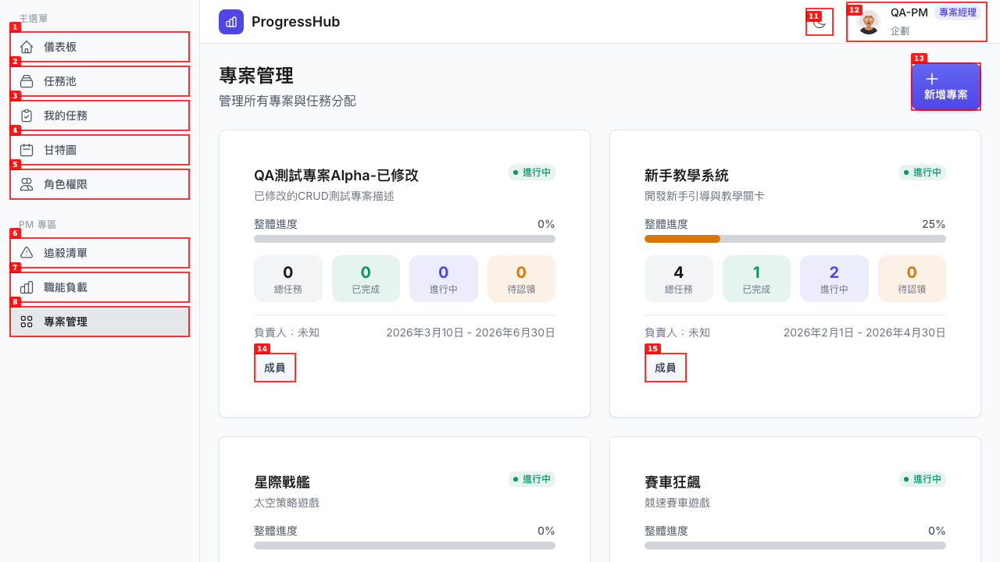
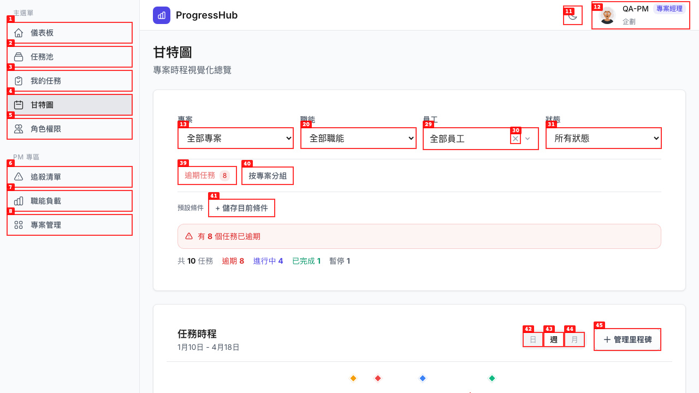
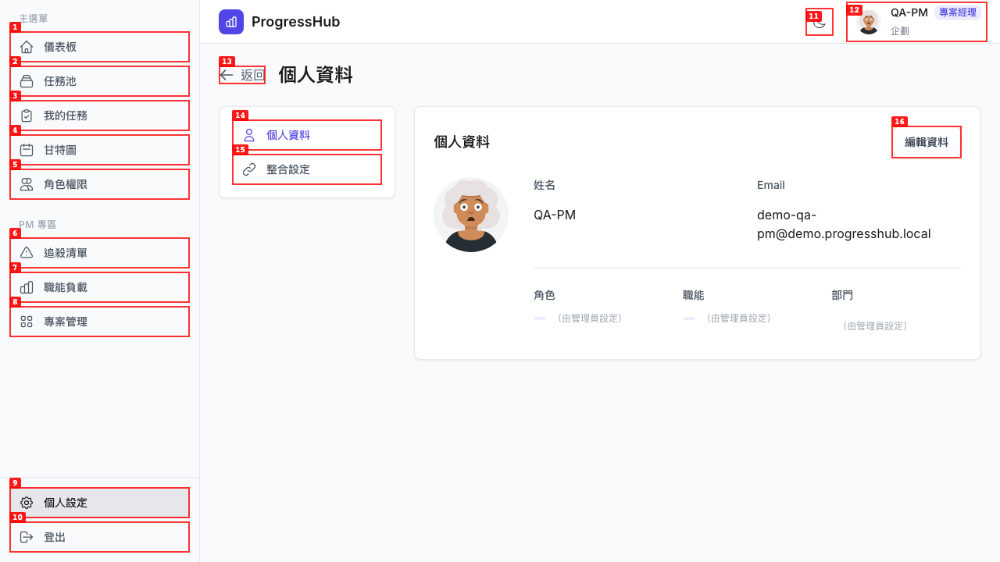
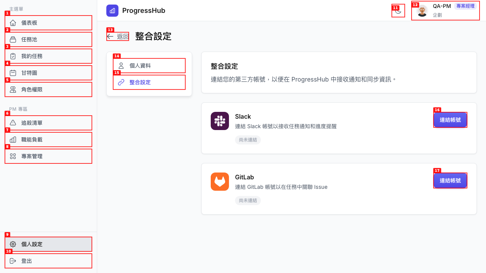
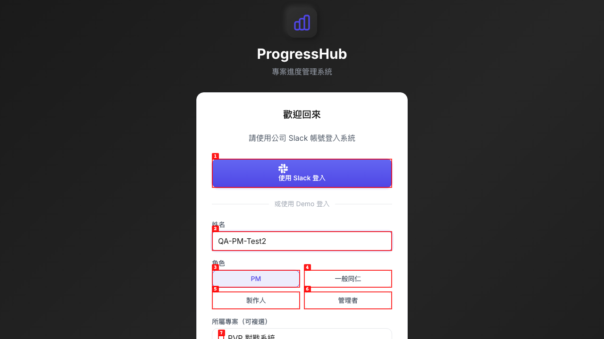
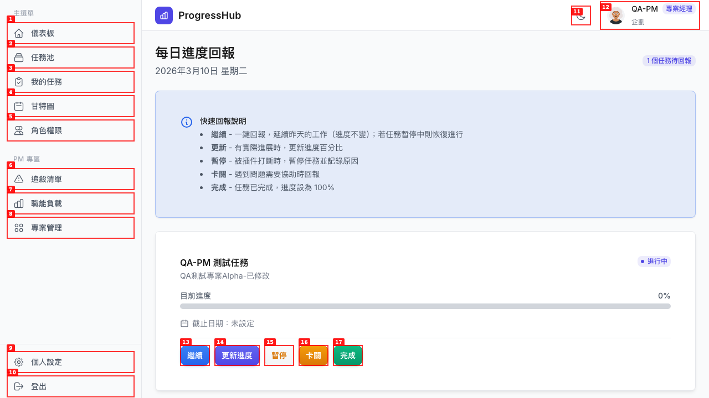
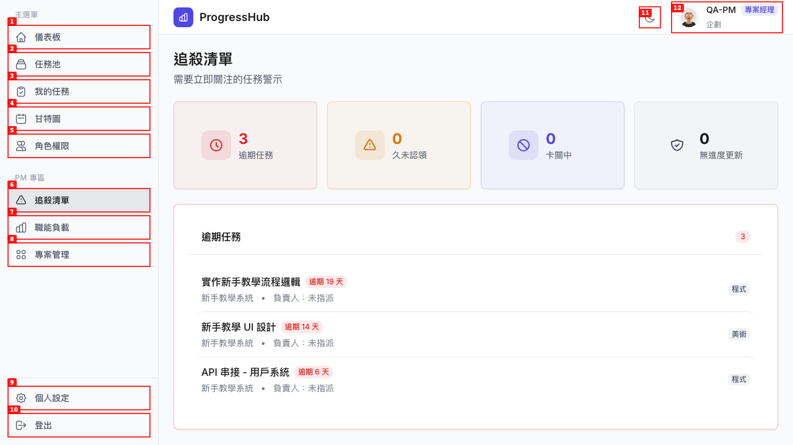

# Dogfood Report: ProgressHub

| Field | Value |
|-------|-------|
| **Date** | 2026-03-10 |
| **App URL** | https://progresshub-cb.zeabur.app |
| **Session** | progresshub-pm |
| **Scope** | PM role — login, projects, chase list, workload, task creation, milestones, gantt, settings |

## Summary

| Severity | Count |
|----------|-------|
| Critical | 0 |
| High | 3 |
| Medium | 5 |
| Low | 0 |
| **Total** | **8** |

## Issues

<!-- Issues will be appended as found -->

### ISSUE-001: 所有專案顯示「負責人：未知」

| Field | Value |
|-------|-------|
| **Severity** | medium |
| **Category** | content / functional |
| **URL** | https://progresshub-cb.zeabur.app/projects |
| **Repro Video** | N/A |

**Description**

專案管理頁面中，所有專案卡片的負責人欄位均顯示「未知」，而非實際負責人姓名。預期應顯示指定 PM 的名稱。這可能代表後端 mapper 在序列化 project manager 欄位時有遺漏，或資料本身未正確關聯。

**Repro Steps**

1. 以 PM 角色登入後，點擊左側「專案管理」
   

2. **Observe:** 所有專案卡片均顯示「負責人：未知」，而非實際負責人姓名

---

### ISSUE-002: 甘特圖任務顯示「未知」負責人，與任務池中不一致

| Field | Value |
|-------|-------|
| **Severity** | high |
| **Category** | content / functional |
| **URL** | https://progresshub-cb.zeabur.app/gantt |
| **Repro Video** | N/A |

**Description**

甘特圖中幾乎所有任務的負責人欄位顯示「未知」，但任務池頁面中同一批任務顯示了真實姓名（如「林小美」、「王小明」）。例如：「賽車模型建模」在甘特圖顯示「未知」，但在任務池中顯示「林小美」為負責人。

這代表甘特圖的任務資料序列化路徑與任務池的路徑不同，前者沒有正確關聯或映射員工姓名。

**Repro Steps**

1. 以 PM 登入後，前往「任務池」觀察「賽車模型建模」顯示負責人「林小美」

2. 前往「甘特圖」，觀察同一任務顯示負責人「未知」
   

3. **Observe:** 甘特圖中幾乎所有任務的負責人都顯示「未知」，而非真實姓名

---

### ISSUE-004: 個人設定頁面未顯示角色、職能、部門實際值

| Field | Value |
|-------|-------|
| **Severity** | medium |
| **Category** | content / ux |
| **URL** | https://progresshub-cb.zeabur.app/settings |
| **Repro Video** | N/A |

**Description**

個人資料頁面中，「角色」、「職能」和「部門」欄位都只顯示「（由管理員設定）」，而非顯示用戶的實際值。標題列中可以看到 QA-PM 的角色是「專案經理 企劃」，但個人資料頁面沒有顯示這些已知資訊。這讓用戶無法確認自己目前被指派的角色和職能。

**Repro Steps**

1. 以 PM 角色登入，點擊左側「個人設定」

2. **Observe:** 「角色」、「職能」、「部門」欄位均顯示「（由管理員設定）」而非實際值，但頂端標頭確實顯示「專案經理 企劃」表示資料存在
   

---

### ISSUE-005: Slack「連結帳號」按鈕點擊後無任何反應

| Field | Value |
|-------|-------|
| **Severity** | high |
| **Category** | functional |
| **URL** | https://progresshub-cb.zeabur.app/settings |
| **Repro Video** | videos/test-slack-oauth.webm |

**Description**

在「整合設定」頁面點擊 Slack「連結帳號」按鈕後，頁面完全沒有反應，沒有跳轉、沒有錯誤訊息、沒有 console 錯誤。用戶不知道操作是否被接受，也不知道為何無法連結。預期行為：應導向 Slack OAuth 授權頁面，或顯示功能不可用的說明。

**Repro Steps**

1. 登入後前往「個人設定」→「整合設定」
   

2. 點擊 Slack 區塊的「連結帳號」按鈕
   

3. **Observe:** 頁面無任何反應，按鈕點擊後靜默失敗，沒有跳轉或錯誤提示

---

### ISSUE-006: Demo 登入表單 PM 角色不強制選擇至少一個專案

| Field | Value |
|-------|-------|
| **Severity** | medium |
| **Category** | functional / ux |
| **URL** | https://progresshub-cb.zeabur.app/login |
| **Repro Video** | N/A |

**Description**

Demo 登入表單中，PM 角色顯示「所屬專案（可複選）」清單，但沒有強制要求至少勾選一個專案。當 PM 角色只填入姓名但不選擇任何專案時，「以 Demo 身分登入」按鈕仍然啟用並可點擊，導致 PM 以「無專案」狀態登入，進入後看不到任何專案資料，也無法正常使用 PM 功能。

**Repro Steps**

1. 前往登入頁面，選擇「PM」角色，填入姓名「QA-PM-Test2」，不勾選任何專案
   

2. **Observe:** 「以 Demo 身分登入」按鈕已啟用，允許 PM 在沒有選擇專案的情況下登入，缺少必要的前端驗證

---

### ISSUE-007: 進度回報頁面「更新進度」按鈕點擊後無反應

| Field | Value |
|-------|-------|
| **Severity** | high |
| **Category** | functional |
| **URL** | https://progresshub-cb.zeabur.app/report |
| **Repro Video** | videos/test-progress-update.webm |

**Description**

進度回報頁面中，點擊「更新進度」按鈕後沒有任何反應 — 沒有彈窗、沒有滑動條、沒有任何讓用戶輸入進度百分比的介面出現。根據頁面說明，「更新」應該讓使用者「更新進度百分比」，但目前完全無法操作。這是一個 broken feature，讓 PM 無法在日報回報頁面更新自己任務的實際進度數字。

**Repro Steps**

1. 認領一個任務後，前往「進度回報」頁面（/report）
   

2. 點擊「更新進度」按鈕

3. **Observe:** 頁面無任何反應，沒有出現輸入進度的介面或彈窗
   

---

### ISSUE-003: 新增專案表單缺少「負責人」欄位

| Field | Value |
|-------|-------|
| **Severity** | medium |
| **Category** | functional / ux |
| **URL** | https://progresshub-cb.zeabur.app/projects |
| **Repro Video** | N/A |

**Description**

「新增專案」表單只包含名稱、說明、開始日期、結束日期、狀態五個欄位，沒有「負責人」選擇欄位。這導致所有新建立的專案負責人均為空（前端顯示「負責人：未知」）。使用者無法在建立專案時指定負責人。

**Repro Steps**

1. 前往「專案管理」頁面，點擊「新增專案」按鈕

2. **Observe:** 表單中沒有「負責人」選擇欄位，無法指定誰負責此專案
   

---

### ISSUE-008: 追殺清單顯示「負責人：未指派」與任務池資料不符

| Field | Value |
|-------|-------|
| **Severity** | medium |
| **Category** | content / functional |
| **URL** | https://progresshub-cb.zeabur.app/pm/chase |
| **Repro Video** | N/A |

**Description**

「追殺清單」中的逾期任務顯示「負責人：未指派」，但同一批任務在「任務池」中有顯示真實負責人。例如「新手教學 UI 設計」在任務池中顯示由「李美玲」負責，但在追殺清單中顯示「負責人：未指派」。這是一個跨頁面的資料一致性問題，與甘特圖的「未知」問題屬於同類根因 — 不同 API 端點的任務資料序列化方式不一致，追殺清單端點未關聯負責人資訊。

**Repro Steps**

1. 以 PM 登入後，前往「任務池」，觀察「新手教學 UI 設計」顯示負責人「李美玲」

2. 前往「追殺清單」頁面
   

3. **Observe:** 同一任務在追殺清單中顯示「負責人：未指派」，而非「李美玲」

---

