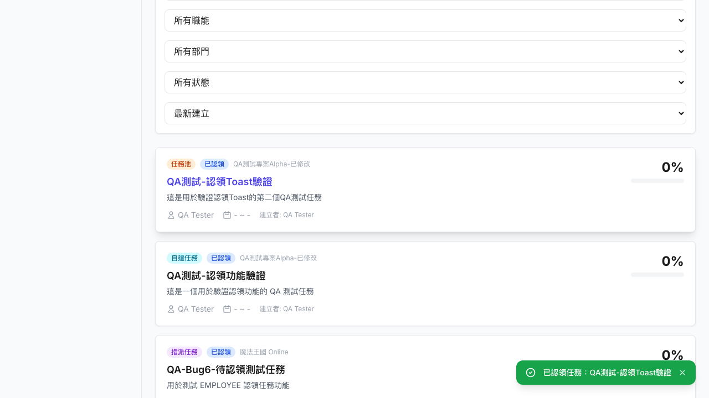
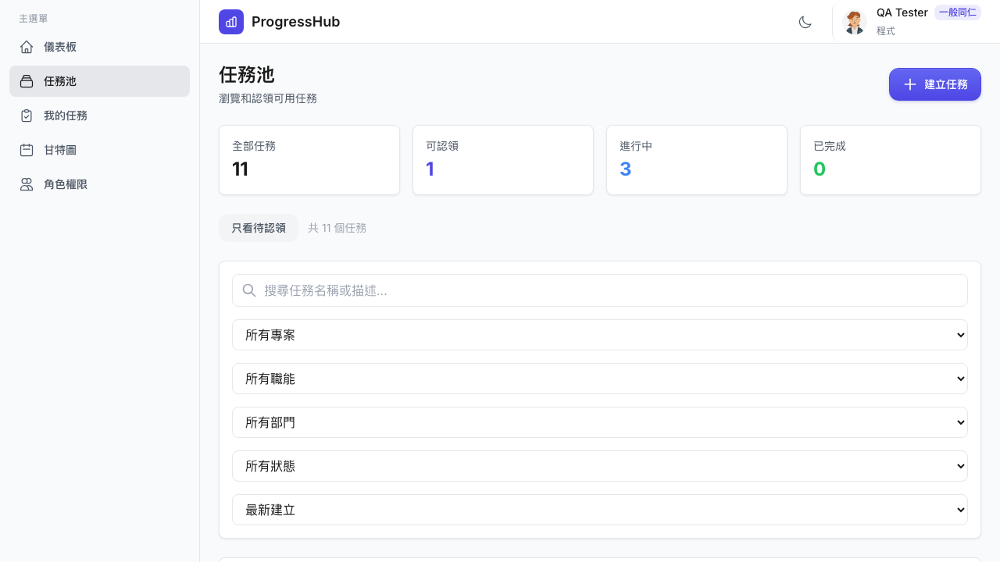
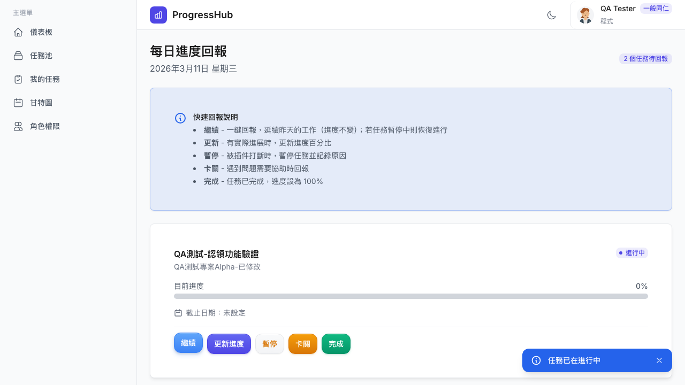
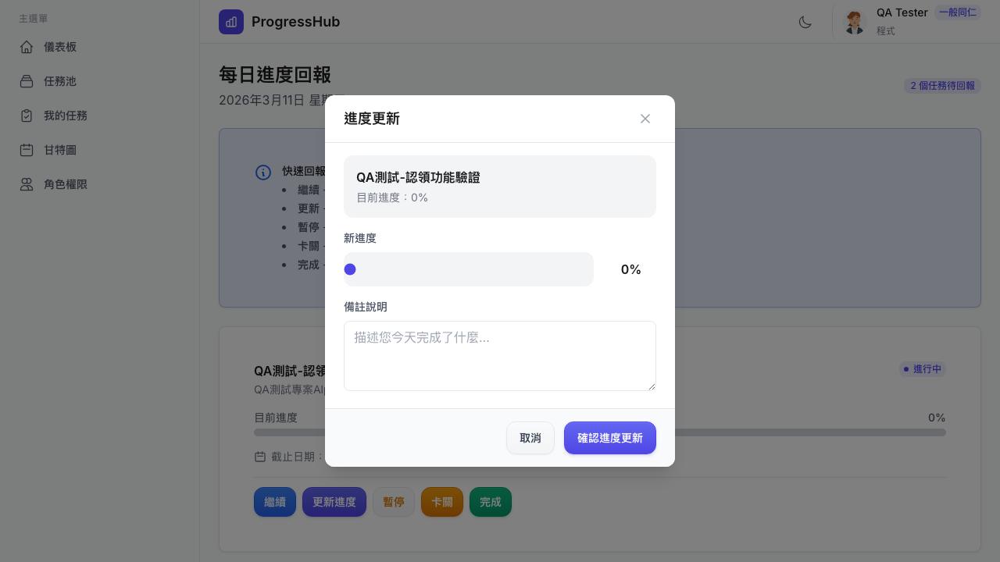
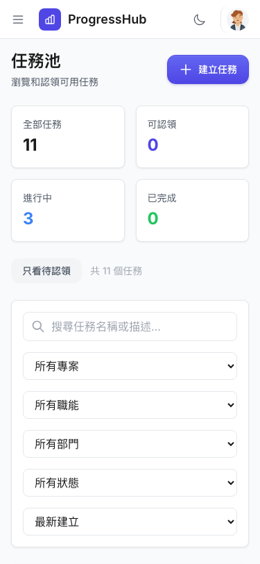
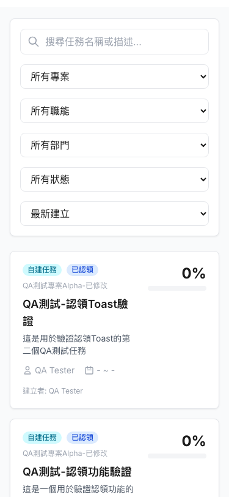
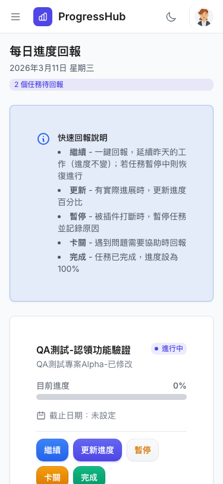
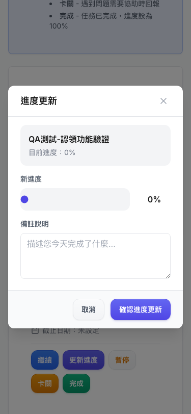

# Dogfood Report: ProgressHub Bug Fix Verification

| Field | Value |
|-------|-------|
| **Date** | 2026-03-11 |
| **App URL** | https://progresshub-cb.zeabur.app |
| **Session** | qa-employee |
| **Scope** | Bug fix verification — task pool claim toast, assignee display, report page continue/update-progress |

## Summary

| Result | Count |
|--------|-------|
| PASS | 4 |
| PARTIAL PASS | 1 |
| FAIL | 0 |
| **Total Tests** | **5** |

All 4 primary bug fixes verified as working. Mobile touch targets show minor sizing concern (38px height, below 44px recommended).

---

## Test Results

### TEST-01: Task Pool — Claim Task Toast

| Field | Value |
|-------|-------|
| **Result** | PASS |
| **Category** | functional / ux |
| **URL** | https://progresshub-cb.zeabur.app/task-pool |
| **Video** | videos/test1-claim-toast-retry.webm |

**Description**

After clicking "認領任務" on an unclaimed task, a green success toast notification appears at the bottom-right of the screen with the message "已認領任務：QA測試-認領Toast驗證".

**Evidence**

1. Loaded task pool page with one unclaimed task (status: 待認領)
   

2. Clicked "認領任務" button
3. Toast notification appeared immediately after click
   

**Verdict:** Fix confirmed working. Toast appears correctly after claiming a task.

---

### TEST-02: Task Pool — Assignee Shows Correctly After Claim

| Field | Value |
|-------|-------|
| **Result** | PASS |
| **Category** | functional / visual |
| **URL** | https://progresshub-cb.zeabur.app/task-pool |
| **Video** | N/A |

**Description**

After claiming a task, the task card shows the user's actual name ("QA Tester") as the assignee, not the placeholder "未知".

**Evidence**

Screenshot taken immediately after claiming shows task card displaying:
- Assignee: "QA Tester" (correct)
- Status: "已認領" (correct)

**Verdict:** Fix confirmed working. Assignee name displays correctly after claim.

---

### TEST-03: Report Page — Continue Button Toast

| Field | Value |
|-------|-------|
| **Result** | PASS |
| **Category** | functional / ux |
| **URL** | https://progresshub-cb.zeabur.app/report |
| **Video** | videos/test3-continue-toast.webm |

**Description**

On the report page, clicking "繼續" on a task that is already in progress shows an informational toast: "任務已在進行中".

**Evidence**

1. Navigated to report page with in-progress tasks
2. Clicked "繼續" button on first task
3. Toast appeared with correct message "任務已在進行中"
   

**Verdict:** Fix confirmed working. Toast message appears correctly when continuing an already-in-progress task.

---

### TEST-04: Report Page — Update Progress Modal

| Field | Value |
|-------|-------|
| **Result** | PASS |
| **Category** | functional |
| **URL** | https://progresshub-cb.zeabur.app/report |
| **Video** | videos/test4-update-progress-modal.webm |

**Description**

On the report page, clicking "更新進度" on a non-paused task opens the progress update modal with a slider and notes field.

**Evidence**

1. Clicked "更新進度" on in-progress task "QA測試-認領功能驗證"
2. Modal "進度更新" opened correctly with:
   - Task name and current progress (0%)
   - Progress slider (新進度)
   - Notes textarea (備註說明)
   - "取消" and "確認進度更新" buttons
   

**Verdict:** Fix confirmed working. Progress update modal opens correctly.

---

### TEST-05: Mobile Touch Targets

| Field | Value |
|-------|-------|
| **Result** | PARTIAL PASS |
| **Category** | accessibility / ux |
| **URL** | https://progresshub-cb.zeabur.app/task-pool, /report |
| **Video** | N/A |

**Description**

Tested at 375×812 mobile viewport (iPhone SE / iPhone 13 mini size).

**Findings**

| Element | Measured Size | 44px Min | Status |
|---------|--------------|----------|--------|
| Action buttons (繼續/更新進度/暫停/卡關/完成) | 38×54–82px | height: 38px < 44px | Minor gap |
| Sidebar navigation items | 40×231px | height: 40px < 44px | Minor gap |
| Icon buttons (dark mode toggle, user avatar) | 36×36px | Both dimensions < 44px | Minor gap |
| Task cards (tappable area) | Full width | Meets requirement | PASS |
| Modal buttons (取消/確認進度更新) | ~44px height | Approximately meets | PASS |

**Evidence**

Task pool mobile view — layout is clean and responsive:

Task pool with task cards on mobile:

Report page on mobile — action buttons visible but slightly below 44px height:

Progress slider modal on mobile:

**Verdict:** Layout is functional and usable on mobile. Action buttons measure 38px height (6px below the 44px WCAG recommendation). This is a pre-existing sizing concern, not a regression from the current fix batch. Sidebar nav items and icon buttons also slightly below threshold. No interaction failures observed.

---

## Overall Verdict

All 4 targeted bug fixes are confirmed working in production:

1. **認領任務 toast** — green success notification appears after claim
2. **Assignee display** — shows user's real name, not "未知"
3. **繼續 button toast** — shows "任務已在進行中" informational message
4. **更新進度 modal** — opens correctly with slider and notes

Mobile responsiveness is functional but action buttons are slightly below WCAG 44px touch target minimum (measuring 38px height). This is a cosmetic/accessibility concern for a future iteration, not a blocker.
