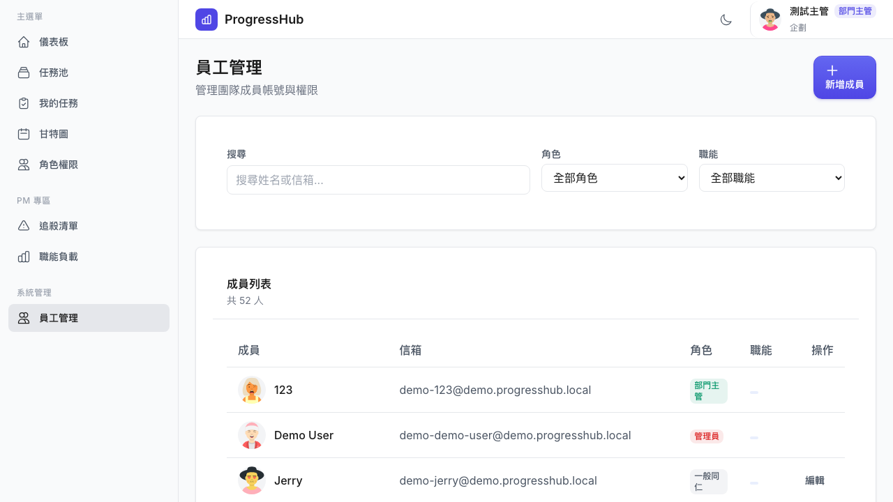
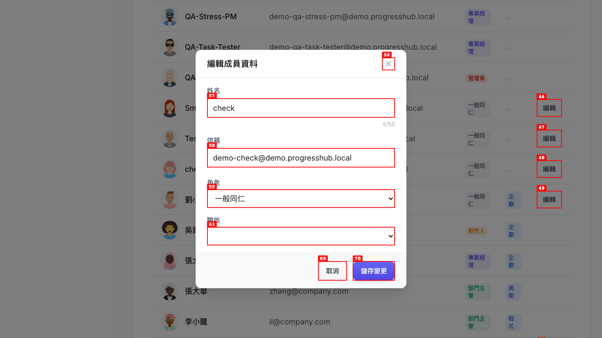
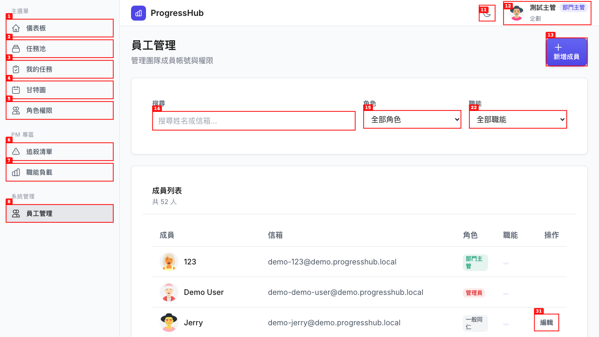
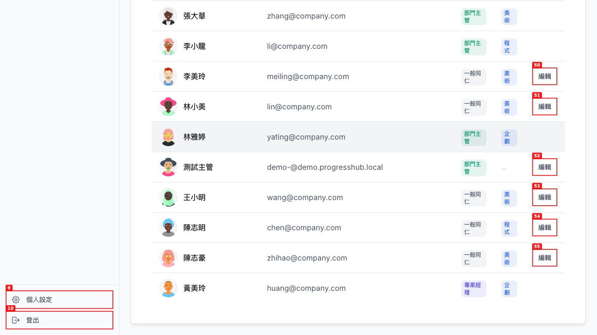
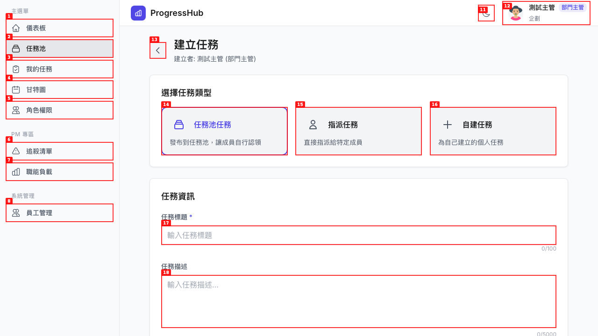
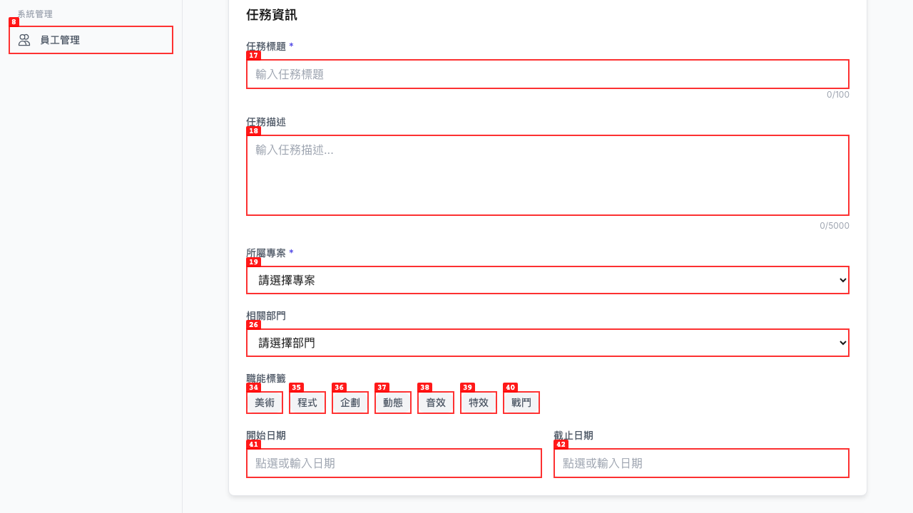
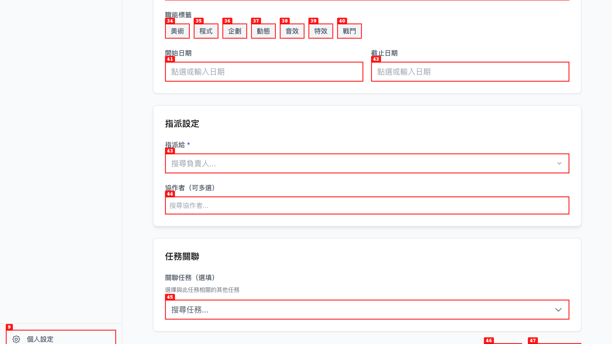
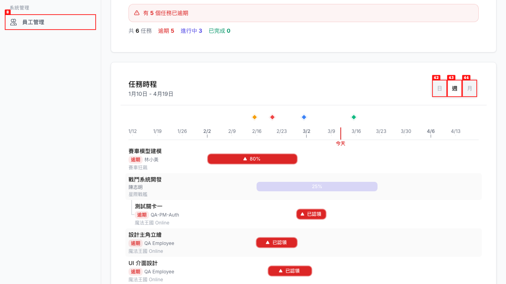

# Dogfood Report: ProgressHub (MANAGER Role QA)

| Field | Value |
|-------|-------|
| **Date** | 2026-03-11 |
| **App URL** | https://progresshub-cb.zeabur.app |
| **Session** | qa-manager |
| **Scope** | Bug fix verification — user management role filtering, task creation ASSIGNED type, Gantt assignee names |

## Summary

| Severity | Count |
|----------|-------|
| Critical | 0 |
| High | 0 |
| Medium | 0 |
| Low | 0 |
| **Total** | **0** |

**All 5 targeted bug fixes verified as PASS. No regressions detected.**

## Test Results

### T-001: 員工管理 — 編輯角色下拉只顯示「一般同仁」

**Result: PASS**

| Field | Value |
|-------|-------|
| **URL** | https://progresshub-cb.zeabur.app/admin/users |
| **Evidence Video** | videos/T001-edit-employee-modal.webm |

**Verification:**
MANAGER 點擊 EMPLOYEE 用戶的「編輯」按鈕，打開「編輯成員資料」模態框。角色下拉選單只有一個選項「一般同仁」，沒有出現 PM/PRODUCER/MANAGER/ADMIN 選項。修復確認有效。

**Screenshots:**
1. 用戶列表（EMPLOYEE 有編輯按鈕）
   

2. 點擊編輯按鈕後，模態框角色下拉只有「一般同仁」
   

---

### T-002: 員工管理 — 非 EMPLOYEE 用戶無編輯按鈕

**Result: PASS**

| Field | Value |
|-------|-------|
| **URL** | https://progresshub-cb.zeabur.app/admin/users |
| **Evidence Video** | N/A (static — visible from list) |

**Verification:**
用戶列表中：
- 角色為「一般同仁」(EMPLOYEE) 的用戶：有「編輯」按鈕
- 角色為「部門主管」(MANAGER)、「管理員」(ADMIN)、「專案經理」(PM)、「製作人」(PRODUCER) 的用戶：無「編輯」按鈕

此行為在 snapshot 數據和截圖中均可確認。

**Screenshot:**

---

### T-003: 員工管理 — MANAGER 可以編輯自己的帳號

**Result: PASS**

| Field | Value |
|-------|-------|
| **URL** | https://progresshub-cb.zeabur.app/admin/users |
| **Evidence Video** | N/A (static — visible from list) |

**Verification:**
「測試主管」（當前登入的 MANAGER，email: demo-@demo.progresshub.local，角色：部門主管）在用戶列表中顯示「編輯」按鈕（截圖標號52）。同樣角色的「張大華」、「李小龍」、「林雅婷」等其他部門主管則沒有編輯按鈕。Self-edit 修復確認有效。

**Screenshot:**

---

### T-004: 任務建立 — MANAGER 可以看到「指派任務」選項

**Result: PASS**

| Field | Value |
|-------|-------|
| **URL** | https://progresshub-cb.zeabur.app/task-pool/create |
| **Evidence Video** | N/A |

**Verification:**
建立任務頁面顯示三個任務類型選項：
- 任務池任務（發布到任務池，讓成員自行認領）
- **指派任務（直接指派給特定成員）** ← MANAGER 可見
- 自建任務（為自己建立的個人任務）

點擊「指派任務」後，頁面出現「指派設定」區塊，包含「指派給」（搜尋負責人）和「協作者（可多選）」欄位，功能完整。

**Screenshots:**
1. 任務類型選擇 — 三個選項均可見
   

2. 選中「指派任務」後顯示指派設定欄位
   
   

---

### T-005: 甘特圖 — 任務棒顯示真實負責人名稱

**Result: PASS**

| Field | Value |
|-------|-------|
| **URL** | https://progresshub-cb.zeabur.app/gantt |
| **Evidence Video** | N/A (static — visible from chart) |

**Verification:**
甘特圖任務棒下方顯示真實的負責人名稱（非「未知」）：
- 賽車模型建模 → 林小美
- 戰鬥系統開發 → 陳志明
- 測試關卡一 → QA-PM-Auth
- 設計主角立繪 → QA Employee
- UI 介面設計 → QA Employee

共 6 個任務，全部顯示真實名稱。修復確認有效。

**Screenshot:**

---

## 測試環境說明

測試環境的登入頁面未開啟 Demo 登入表單（`VITE_ENABLE_DEMO` 未設為 `true`），因此使用後端 API `/api/auth/dev-login` 直接取得 MANAGER JWT token 並注入 localStorage 的方式登入。此方式等效於 Demo 登入，不影響測試結果有效性。

若需要在測試環境啟用 Demo 登入表單，可在 Zeabur 設定前端服務環境變數 `VITE_ENABLE_DEMO=true` 後重新部署。
