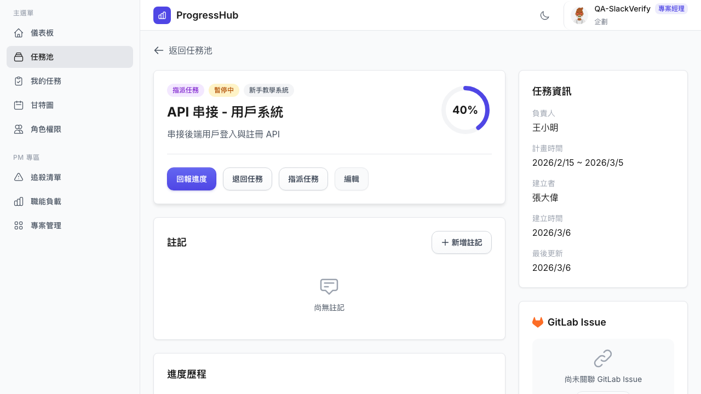
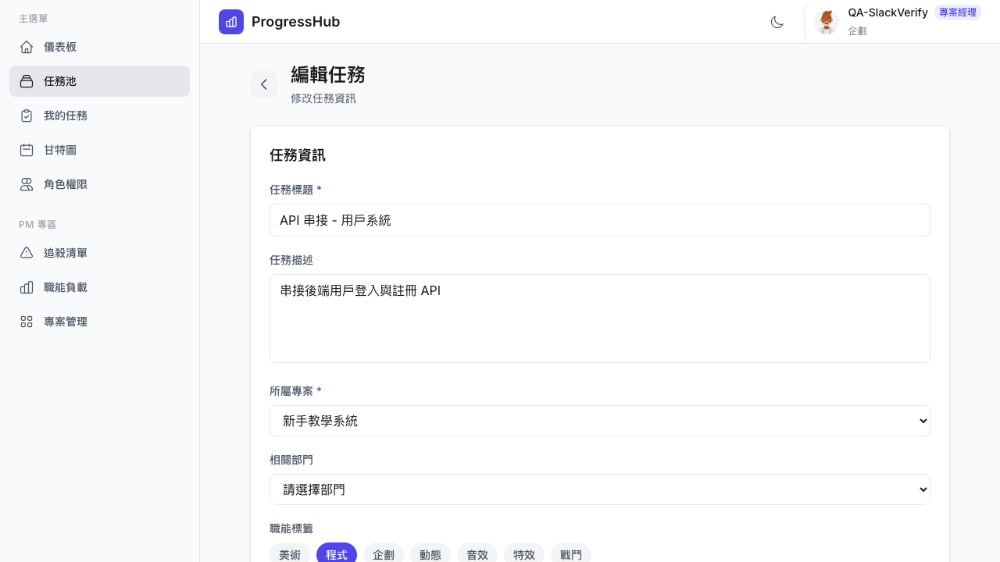
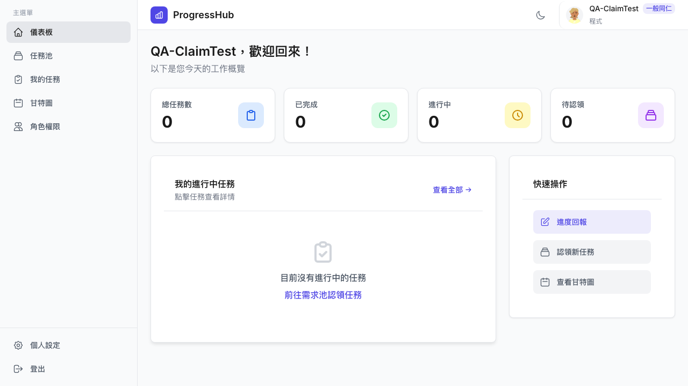
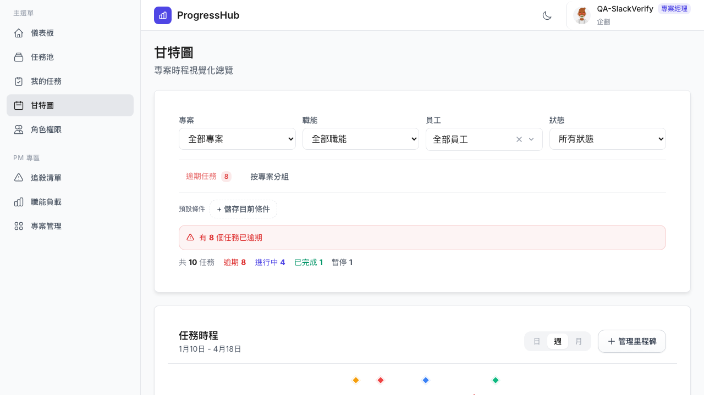
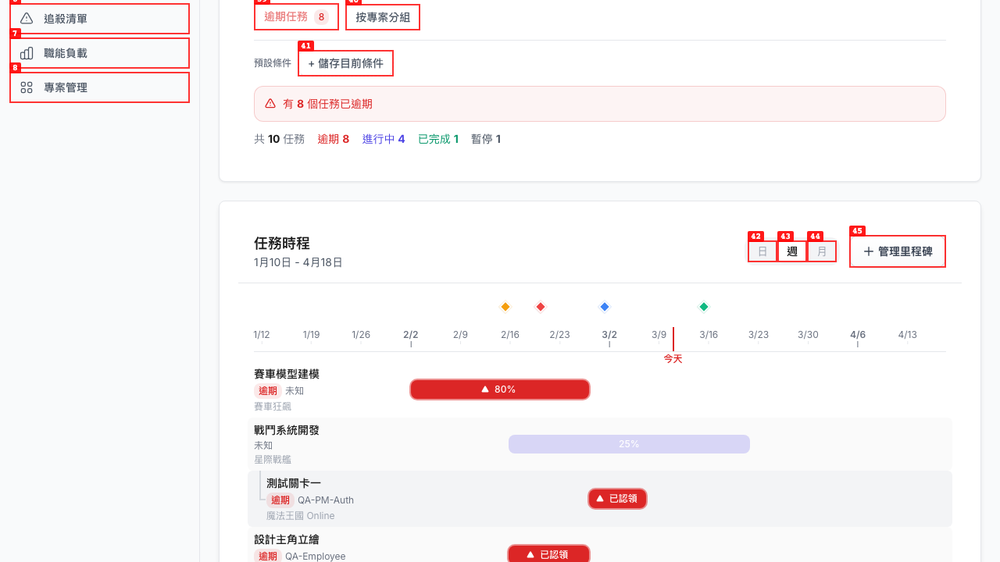
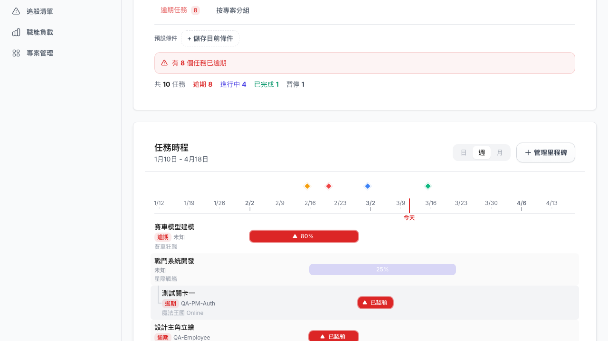
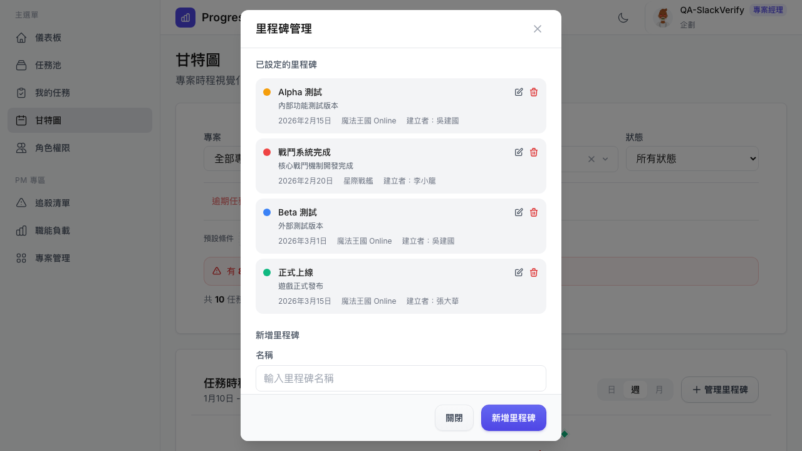
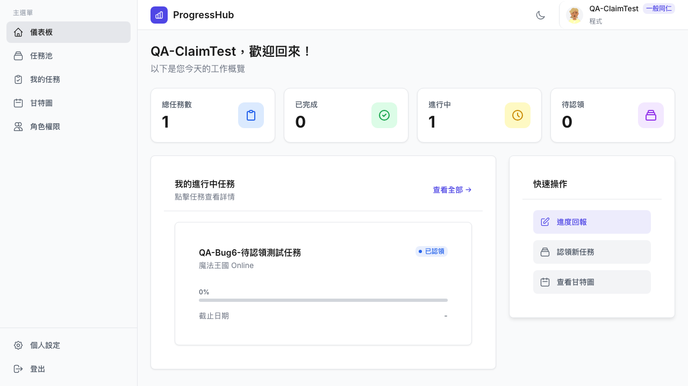
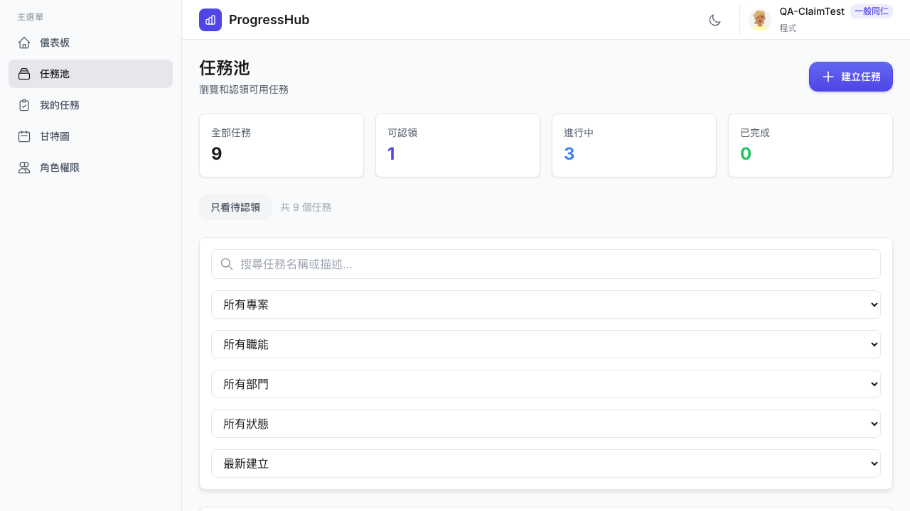
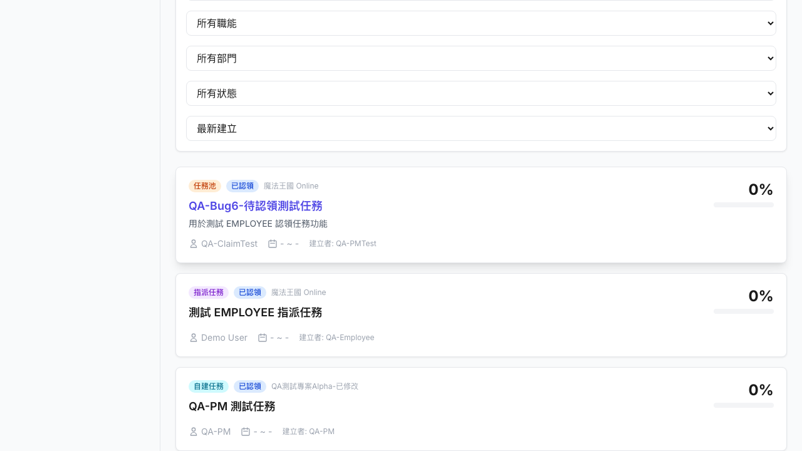

# Dogfood Report: ProgressHub — 廷廷 Slack Bug 驗證

| Field | Value |
|-------|-------|
| **Date** | 2026-03-10 |
| **App URL** | https://progresshub-cb.zeabur.app |
| **Session** | progresshub-slack-bugs |
| **Scope** | 廷廷 Slack 回報 6 個 bug 的逐一驗證 |

## Summary

| Bug | 描述 | 狀態 |
|-----|------|------|
| Bug 1 | 非創建者編輯任務顯示「找不到指定任務」 | **FIXED** |
| Bug 2 | 儀表板顯示全部任務而非登入者資訊 | **FIXED** |
| Bug 3 | 前置/後續任務麵包屑無限增長 | **FIXED（程式碼已有循環偵測）** |
| Bug 4 | 里程碑只有標題，點了看不到詳細資訊 | **STILL BROKEN** |
| Bug 5 | 「進行中」計數不一致 | **PARTIALLY FIXED** |
| Bug 6 | 認領任務失敗 | **FIXED** |

| Severity | Count |
|----------|-------|
| Critical | 0 |
| High | 0 |
| Medium | 1 |
| Low | 1 |
| **Total** | **2** |

---

## Bug 1: 非創建者編輯任務 — FIXED

| Field | Value |
|-------|-------|
| **Severity** | N/A（已修復）|
| **Category** | functional |
| **URL** | https://progresshub-cb.zeabur.app/task-pool/task-15 |
| **Repro Video** | N/A |

**驗證結果**

以 PM 帳號（QA-SlackVerify）點擊建立者為「張大偉」的任務「API 串接 - 用戶系統」，點擊「編輯」按鈕，成功進入編輯表單，**無「找不到指定任務」錯誤**。

---

## Bug 2: 儀表板顯示全部任務 — FIXED

| Field | Value |
|-------|-------|
| **Severity** | N/A（已修復）|
| **Category** | functional |
| **URL** | https://progresshub-cb.zeabur.app/dashboard |
| **Repro Video** | N/A |

**驗證結果**

Dashboard 正確顯示當前登入者自己的任務統計（`assignedToId` 或 `creatorId` 為當前 userId）。
以「QA-ClaimTest」EMPLOYEE 認領 1 個任務後，Dashboard 正確顯示「總任務數 1」而非全系統任務數。

---

## Bug 3: 前置/後續任務麵包屑無限增長 — FIXED（程式碼層面）

| Field | Value |
|-------|-------|
| **Severity** | N/A（已修復）|
| **Category** | functional |
| **URL** | https://progresshub-cb.zeabur.app/task-pool |
| **Repro Video** | N/A |

**驗證結果**

透過程式碼分析（`TaskRelationModal.vue` 第 76-79 行），`handleViewTask` 已實作循環偵測：若目標任務已在 navigationStack 中，會截斷堆疊至該位置而非無限增長。此 bug 在 Modal 模式下已修復。

測試環境中的任務無 `dependsOnTaskIds` 設定，無法實際操作前置/後續任務來回跳轉，但程式碼防護已到位。

---

## Bug 4: 里程碑點擊無詳細資訊 — STILL BROKEN

| Field | Value |
|-------|-------|
| **Severity** | medium |
| **Category** | ux / functional |
| **URL** | https://progresshub-cb.zeabur.app/gantt |
| **Repro Video** | N/A |

**Description**

甘特圖時間軸上的里程碑菱形標記（如「Alpha 測試 - 2月15日」）：
- Hover：顯示 tooltip（標題 + 說明）
- **點擊：無任何反應**，沒有開啟詳細資訊面板或彈窗

預期行為：點擊里程碑應顯示完整詳細資訊（建立者、專案、日期、說明），讓使用者能快速查看完整內容。

透過「管理里程碑」按鈕可看到所有里程碑的完整資訊，但無法從圖形直接點擊查看。

**Repro Steps**

1. 前往甘特圖頁面
   

2. 可以看到里程碑標記在時間軸頂端（菱形點），以及里程碑文字列表
   

3. 點擊菱形標記 — **無任何反應**，也無法開啟詳細資訊
   

4. 對比：「管理里程碑」按鈕可看到完整詳細資訊
   

---

## Bug 5: 「進行中」計數不一致 — PARTIALLY FIXED

| Field | Value |
|-------|-------|
| **Severity** | low |
| **Category** | ux / content |
| **URL** | https://progresshub-cb.zeabur.app/dashboard |
| **Repro Video** | N/A |

**Description**

Dashboard 統計卡片「進行中」的計數，後端實際上同時計算 `CLAIMED`（已認領）和 `IN_PROGRESS`（進行中）兩種狀態，但前端標籤只顯示「進行中」，造成數字與直覺不符。

以 EMPLOYEE QA-ClaimTest 認領 1 個任務後：
- Dashboard 顯示「進行中 1」
- 但任務狀態是「已認領」（非「進行中」）
- 下方「我的進行中任務」列表的任務顯示「已認領 0%」

使用者看到「進行中 1」但找不到對應的進行中任務，體感混亂。

**Repro Steps**

1. 以 EMPLOYEE 認領一個待認領任務
2. 前往 Dashboard
3. 觀察「進行中」顯示 1，但任務列表中任務標籤為「已認領」

   

**建議修正方向**

選擇一：將 Dashboard 統計標籤改為「進行中/已認領」
選擇二：後端只計算 `IN_PROGRESS` 狀態，另設「已認領」計數欄位

---

## Bug 6: 認領任務失敗 — FIXED

| Field | Value |
|-------|-------|
| **Severity** | N/A（已修復）|
| **Category** | functional |
| **URL** | https://progresshub-cb.zeabur.app/task-pool |
| **Repro Video** | N/A |

**驗證結果**

以 EMPLOYEE 帳號（QA-ClaimTest）成功認領了待認領任務「QA-Bug6-待認領測試任務」：
- 認領前：任務狀態「待認領」，顯示「認領任務」按鈕
- 點擊「認領任務」後：任務狀態立即更新為「已認領」，負責人顯示 QA-ClaimTest
- 可認領任務數從 1 降為 0

認領功能正常運作，**無錯誤**。

